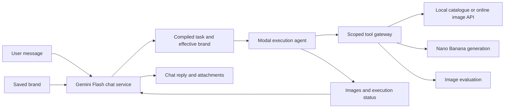

# Brand chat agent backend

English | [简体中文](chat_agent_backend.CN.md)

This backend implements the product flow: save a company brand, open a conversation,
search the collection, and send “Use image ID X in our company style.” Subsequent
messages can ask for changes to the previous result. Frontend chat design is deferred.
This document supersedes the single-request product flow in the original image-agent design.

## Chat service and sandbox executor

Gemini Flash handles the conversation in the trusted backend. It reads the saved
brand and conversation, replies or asks questions, and compiles an execution request
only when the user asks for image generation or editing. Greetings and clarification
never start a sandbox. The worker processes chat asynchronously, outside API requests.



The sandbox receives a bounded task: compiled prompt, exact source image ID or prior
asset ID, aspect ratio, the current user request, brand version, effective brand
snapshot, and explicit overrides. It receives no conversation history and has no
chat/reply tool. It resolves the source, generates with Nano Banana, checks the result,
optionally makes one revision, and returns structured results. The trusted gateway
proxies tools and keeps provider, storage, and database credentials outside the sandbox.

The chat service uses Gemini Flash again to describe completed or failed execution.
If that summary call fails, the backend attaches the real outputs with a fallback
message. Successful generation is not lost because the final chat response failed.
Users continue editing in the same conversation; the last successful image is the
default subject unless they select another image.

### Instruction precedence

**Current user request > relevant conversation context > saved brand defaults.**
For example, a red brand palette plus “use blue for this image” produces an effective
blue palette for this task. Explicit colors, preserve, and avoid overrides are merged
into a copied brand snapshot. Unspecified brand characteristics stay in the task.
The stored brand version is never changed. Both Nano Banana generation and image
evaluation receive the effective brand, so evaluation does not reject a requested
override merely because it differs from the saved profile. The raw current request
also travels with the compiled prompt to preserve its priority.

Gemini Interactions uses `AGENT_CHAT_MODEL` (default `gemini-3.8-flash`), structured
`reply`/`execute` decisions, `store=False`, and application-managed conversation history.
The SDK normalizes `attempts=0` to one and treats that as an Interactions retry count;
the adapter explicitly disables that resource's retry configuration. Provider intent
is recorded before submission. A stale/ambiguous chat claim is not automatically
replayed. Logfire spans `chat.prepare`, sandbox tools, and `chat.result` trace the flow.

Statuses progress through `chat_queued → chat_preparing`, then either a direct reply
or `queued → starting → running → execution_done → chat_returning → succeeded/failed`.
Cancellation and timeouts remain available. Execution results and messages are durable;
idle conversations do not retain a sandbox.

## API contract

All endpoints use the existing workspace bearer credential or signed cookie.
Existing brand, reference upload, run events, cancellation, and asset download APIs
remain available.

| Endpoint | Behavior |
| --- | --- |
| `POST /api/v1/agent/conversations` | Create with `brand_version` and optional `title`; returns the conversation ID |
| `GET /api/v1/agent/conversations` | List up to 100 conversations in the workspace, newest activity first |
| `GET /api/v1/agent/conversations/{id}` | Read ordered messages, run status/error for each turn, image IDs, file URLs, and provenance |
| `POST /api/v1/agent/conversations/{id}/messages` | Send `content` and optional `subject_asset_id`; requires `Idempotency-Key`; returns HTTP 202 with `message_id` and `run` |
| `GET /api/v1/agent/runs/{run_id}/events` | SSE progress, resumable with `Last-Event-ID`; `assistant_message` indicates publication |
| `GET /api/v1/agent/runs/{run_id}` | Poll progress/results or inspect partial output after failure |
| `POST /api/v1/agent/runs/{run_id}/cancel` | Cancel the current turn; later messages can continue the conversation |

Assistant text and attached generated asset IDs appear atomically in conversation
history. SSE reports progress rather than token-by-token text. Clients fetch the
conversation after the run finishes. Failed/cancelled turns retain their user
message and run status; no fabricated assistant success is appended.

Submitting the same message and idempotency key returns the original run, including
its current status. Reusing the key with different content returns 409. A conversation
allows only one unfinished turn; another submission returns `conversation_busy`.
Workspace claims still allow one active sandbox. There are at most 20 user turns
per conversation, one Flash preparation call, at most one Flash result-response call,
and one initial image plus one revision per execution task. Context is not silently truncated. Clarification is an ordinary
assistant reply; the user's answer is the next message. Successful generated results
become the default subject of the next turn. Explicit subject selection overrides it.

## Collection image bridge

Use the search result's exact `image_id`, not its title or museum `record_uid`.
The agent can extract the ID from ordinary message text. The executor calls the gateway to resolve it. By default the gateway reads the active
ready generation in the local catalogue using read-only SQLite. When
`AGENT_COLLECTION_API_URL` is configured, it uses that trusted HTTPS API instead,
calling `GET /api/v1/images/{image_id}` and `GET /api/v1/images/{image_id}/file`.
Optional `AGENT_COLLECTION_API_TOKEN` provides bearer authentication. It does not
follow redirects or use a model/metadata-supplied download URL. Exact ID lookup
needs no Qdrant query or new embedding request. Local reads enforce the image root and catalogue checksum. Online reads validate
the returned ID and bound metadata/image payloads. Both paths decode the image
before copying it into private agent storage. Once imported, this
copy stays pinned to the conversation even if the catalogue changes.

Source metadata retains the collection generation, image ID, record/image UIDs,
title, licence, copyright, and credit. Generated images link their input asset IDs,
so provenance can be followed across edits. Missing IDs produce a conversational
request to check the ID; no image generation is submitted. Models cannot supply a
filesystem path or external URL to this bridge.

This bridge resolves references and preserves rights metadata; it does not determine
whether the intended derivative use is licensed. The operator is responsible for
selecting assets authorized for that use. A deployment needing enforced rights
approval must add its policy before exposing collection generation to other users.
Outputs remain separate from the official collection index.

## Run in the isolated worktree

The implementation worktree is `/Users/archie.yang/project/multimodal-worktrees/chat-agent`,
on branch `codex/chat-agent`. The original workspace and its running services were
not changed. Existing uncommitted implementation files were copied as a baseline;
credentials, image data, databases, and frontend dependencies were not copied.

From that worktree, install with `uv sync --locked --all-packages`, then create its
own ignored `.env`. Configure the Gemini key, Logfire token, workspace access key,
and public HTTPS gateway as in [Image Studio setup](image_agent_setup.md). Use a
separate port, Modal app, workspace, and database:

```dotenv
AGENT_ENABLED=true
AGENT_ENVIRONMENT=development
AGENT_WORKSPACE=chat-dev
AGENT_DATABASE_URL=sqlite:///data/agent-chat/agent.sqlite3
AGENT_STORAGE=local
AGENT_MODAL_APP=multimodal-chat-dev
AGENT_CHAT_MODEL=gemini-3.8-flash
AGENT_COLLECTION_DATABASE=/Users/archie.yang/project/multimodal/data/search/catalog.sqlite3
AGENT_COLLECTION_IMAGE_ROOT=/Users/archie.yang/project/multimodal/data/images
# AGENT_ACCESS_TOKEN, GEMINI_API_KEY, LOGFIRE_TOKEN, and AGENT_GATEWAY_URL also required.
```

Point a separate HTTPS tunnel at `http://127.0.0.1:8002` and use that origin as
`AGENT_GATEWAY_URL`. Create the separate Modal app once with:

```sh
uv run --package multimodal-backend python -c 'import modal; modal.App.lookup("multimodal-chat-dev", create_if_missing=True)'
```

Start the API directly, without building the frontend:

```sh
uv run --package multimodal-backend uvicorn app.services.agent.application:create_agent_app --factory --host 127.0.0.1 --port 8002
```

In another terminal in the same worktree, run `make agent-worker`. This worker coordinates Flash chat and
separately dispatches compiled image tasks to Modal. Chat-only requests need Gemini;
image execution additionally needs the HTTPS gateway. Startup applies
migration `agent_0002`, adding conversations/messages while preserving existing
agent tables. Modal credentials use the existing CLI profile or exported environment
variables. Only the gateway and task token enter the sandbox.

Cloud deployments can configure a trusted online collection API or make the
read-only catalogue and image root available to the gateway. The existing production
image does not bundle local collection data. Imported subjects and generated images use the configured S3 storage.

## Try the API

Use FastAPI `/docs` or an HTTP client. First save a brand with
`POST /api/v1/agent/brands`, including reference asset IDs returned by the existing
upload endpoint. Use the response's `id` as `brand_version`.

Create a conversation:

```http
POST /api/v1/agent/conversations
Authorization: Bearer <workspace-access-key>
Content-Type: application/json

{"brand_version":"<brand-version-id>","title":"Autumn campaign"}
```

Send the first message:

```http
POST /api/v1/agent/conversations/<conversation-id>/messages
Authorization: Bearer <workspace-access-key>
Idempotency-Key: campaign-message-1
Content-Type: application/json

{"content":"Use image ID <search-result-image_id> and redesign it in our company style."}
```

Poll the returned `run.id` or follow its event stream. Fetch the conversation to
read the reply and download its attachments. Then send a new message to the same
conversation with a new idempotency key:

```json
{"content":"Keep the subject, but change the background to our brand blue."}
```

## Verification and limits

Run `uv run pytest backend/tests/test_chat.py backend/tests/test_agent.py` and
`uv run ruff check .`. Tests exercise the trusted chat coordinator and actual sandbox execution loop against
fake providers, real catalogue fixtures, a mocked online API, authentication, persistent
history, edits, cancellation, ambiguous calls, schema migration, and the locked SDK's
single HTTP attempt on failure. Boundary tests prove chat does not start a sandbox,
executors cannot call chat tools, and color overrides reach generation and evaluation
without changing the saved brand.

No chat frontend is added. Current authentication still represents one configured
workspace operator rather than company membership/SSO. Real Gemini chat quality,
cloud catalogue availability, and end-to-end conversation traces require an
explicitly configured development deployment; mocked tests do not verify those.


The shared search catalogue now uses Neon PostgreSQL. Configure
`AGENT_COLLECTION_API_URL` with the trusted HTTPS collection API origin to use
that catalogue from the agent. `AGENT_COLLECTION_DATABASE` reads a legacy local
SQLite snapshot only; it does not connect directly to Neon. Without either an
available snapshot or the API configuration, collection-ID generation returns
`collection_unavailable`. Uploaded-asset generation remains independent of search.
