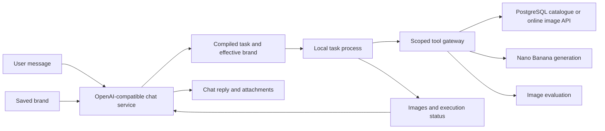

# Brand chat agent backend

English | [简体中文](chat_agent_backend.CN.md)

This documents the existing Image Studio prototype. The first web release will
provide collection exploration through Codex, with image generation deferred;
see the [version and harness decision](product_versions.md). The Codex integration
is not implemented by these APIs.

This backend implements the product flow: save a company brand, open a conversation,
search the collection, and send “Use image ID X in our company style.” Subsequent
messages can ask for changes to the previous result. The collection sidebar
connects to these APIs when `AGENT_ENABLED=true`. Chat and image generation are
deferred from the search-only HF release.

## Chat service and task executor

The OpenAI-compatible harness handles the conversation in the trusted backend. It reads the saved
brand and conversation, replies or asks questions, and compiles an execution request
only when the user asks for image generation or editing. Greetings and clarification
never start a task process. The worker processes chat asynchronously, outside API requests.


```mermaid
flowchart LR
    User[User message] --> Chat[OpenAI-compatible chat service]
    Brand[Saved brand] --> Chat
    Chat --> Task[Compiled task and effective brand]
    Task --> Executor[Local task process]
    Executor --> Tools[Scoped tool gateway]
    Tools --> Images[PostgreSQL catalogue or online image API]
    Tools --> Nano[Nano Banana generation]
    Tools --> Check[Image evaluation]
    Executor --> Result[Images and execution status]
    Result --> Chat
    Chat --> Reply[Chat reply and attachments]
```

The task process receives a bounded task: compiled prompt, exact source image ID or prior
asset ID, aspect ratio, the current user request, brand version, effective brand
snapshot, and explicit overrides. It receives no conversation history and has no
chat/reply tool. It resolves the source, generates with Nano Banana, checks the result,
optionally makes one revision, and returns structured results. The trusted gateway
proxies tools; provider, storage, and database credentials are not passed in the task
process environment. All processes share the container filesystem and network; this
is not a security sandbox.

The chat service calls the harness again to describe completed or failed execution.
If that summary call fails, the backend attaches the real outputs with a fallback
message. Successful generation is not lost because the final chat response failed.
Users continue editing in the same conversation; the last successful image is the
default subject unless they select another image.

### Instruction precedence

**Current user request > relevant conversation context > saved brand defaults.**
For example, a red brand palette plus “use blue for this image” produces an effective
blue palette for this task. Explicit colors, preserve, and avoid overrides are merged
into a copied brand snapshot. Unspecified brand characteristics stay in the task.
The stored brand version is never changed. Both Nano Banana generation and image
evaluation receive the effective brand, so evaluation does not reject a requested
override merely because it differs from the saved profile. The raw current request
also travels with the compiled prompt to preserve its priority.

The OpenAI Python client uses Chat Completions with strict JSON Schema structured
`reply`/`execute` decisions, `store=False`, and application-managed conversation history.
Configure `AGENT_OPENAI_BASE_URL`, `AGENT_OPENAI_API_KEY`, and `AGENT_MODEL`.
`AGENT_CHAT_MODEL` and `AGENT_EVALUATION_MODEL` optionally override the shared model.
Planning and evaluation send image inputs to the same endpoint; Gemini is used only
for Nano Banana image generation. Install the `agent` dependency extra first.
The client sets `max_retries=0` and a 120-second timeout. Provider intent is recorded
before submission, and ambiguous calls are never replayed automatically.
Logfire records metadata-only spans for the harness and task tools; it does not
instrument provider request or response content.

Statuses progress through `chat_queued → chat_preparing`, then either a direct reply
or `queued → starting → running → execution_done → chat_returning → succeeded/failed`.
Cancellation and timeouts remain available. Execution results and messages are durable;
idle conversations do not retain a task process.

## API contract

All endpoints use the workspace bearer credential or signed cookie. Brands and
assets are scoped to that workspace.

| Endpoint | Behavior |
| --- | --- |
| `POST /api/v1/agent/conversations` | Create with `brand_version` and optional `title`; returns the conversation ID |
| `GET /api/v1/agent/conversations` | List up to 100 conversations in the workspace, newest activity first |
| `GET /api/v1/agent/conversations/{id}` | Read ordered messages, run status/error for each turn, image IDs, file URLs, and provenance |
| `POST /api/v1/agent/conversations/{id}/messages` | Send `content` and optional `subject_asset_id`; requires `Idempotency-Key`; returns HTTP 202 with `message_id` and `run` |
| `GET /api/v1/agent/runs/{run_id}/events` | SSE progress, resumable with `Last-Event-ID`; `assistant_message` indicates publication |
| `GET /api/v1/agent/runs/{run_id}` | Poll progress/results or inspect partial output after failure |
| `POST /api/v1/agent/runs/{run_id}/cancel` | Cancel the current turn; later messages can continue the conversation |

Assistant text and attached generated asset IDs appear atomically in conversation
history. SSE reports progress rather than token-by-token text. Clients fetch the
conversation after the run finishes. Failed/cancelled turns retain their user
message and run status; no fabricated assistant success is appended.

Submitting the same message and idempotency key returns the original run, including
its current status. Reusing the key with different content returns 409. A conversation
allows only one unfinished turn; another submission returns `conversation_busy`.
Workspace claims still allow one active task process. There are at most 20 user turns
per conversation, one harness preparation call, at most one harness result-response call,
and one initial image plus one revision per execution task. Context is not silently truncated. Clarification is an ordinary
assistant reply; the user's answer is the next message. Successful generated results
become the default subject of the next turn. Explicit subject selection overrides it.

## Collection image bridge

Use the search result's exact `image_id` or a `co` collection record ID.
The agent can extract the ID from ordinary message text. The executor calls the gateway to resolve it. By default the gateway reads the active
ready generation in the shared PostgreSQL catalogue using `DATABASE_URL`. When
`AGENT_COLLECTION_API_URL` is configured, it uses that trusted HTTPS API instead,
calling `GET /api/v1/images/{image_id}` and `GET /api/v1/images/{image_id}/file`.
Optional `AGENT_COLLECTION_API_TOKEN` provides bearer authentication. It does not
use a model/metadata-supplied download URL. Redirects are rejected. Exact ID lookup
needs no Qdrant query or new embedding request. Direct catalogue reads use
`IMAGE_ROOT`, overridden by `AGENT_COLLECTION_IMAGE_ROOT`, pointing at the HF
bucket mount or local development directory. They enforce the catalogue checksum
and image byte limit. Missing files return an error. Online reads validate
the returned ID and bound metadata/image payloads. Both paths decode the image
before copying it into private agent storage. Once imported, this
copy stays pinned to the conversation even if the catalogue changes.

Source metadata retains the collection generation, image ID, record/image UIDs,
title, licence, copyright, and credit. Generated images link their input asset IDs,
so provenance can be followed across edits. Missing IDs produce a conversational
request to check the ID; no image generation is submitted. Models cannot supply a
filesystem path or external URL to this bridge.

This bridge resolves references and preserves rights metadata; it does not determine
whether the intended derivative use is licensed. The operator is responsible for
selecting assets authorized for that use. A deployment needing enforced rights
approval must add its policy before exposing collection generation to other users.
Outputs remain separate from the official collection index.

The chat executor accepts `co` collection record IDs as well as image UUIDs.
For a record ID, the trusted gateway queries `DATABASE_URL` using an exact bound
`record_uid` match in a read-only, repeatable-read transaction. All distinct images
from the active ready generation are returned. A single match is resolved to its
UUID before loading from the configured collection API or mounted image root.
Multiple matches are returned to chat for selection; the agent does not choose an
arbitrary image. Missing records and unavailable catalogues have separate errors.
Imported assets retain `requested_record_uid`, the resolved image UUID, and attribution.
The gateway process needs the catalogue connection even when image bytes use the
online API.

## Run locally

From the repository root, install with `uv sync --locked --all-packages --extra agent`, then
configure an ignored `.env` as in [Image Studio setup](image_agent_setup.md):

```dotenv
AGENT_ENABLED=true
AGENT_ENVIRONMENT=development
AGENT_WORKSPACE=chat-dev
AGENT_DATABASE_URL=sqlite:///data/agent-chat/agent.sqlite3
AGENT_STORAGE=local
AGENT_OPENAI_BASE_URL=https://api.openai.com/v1
AGENT_OPENAI_API_KEY=<provider key>
AGENT_MODEL=<vision model available at the endpoint>
AGENT_CHAT_MODEL=
AGENT_EVALUATION_MODEL=
# Set AGENT_ACCESS_TOKEN and GEMINI_API_KEY; configure Logfire when needed.
# DATABASE_URL supplies the shared catalogue.
# IMAGE_ROOT or AGENT_COLLECTION_IMAGE_ROOT supplies collection images.
```

Start the API and worker together, without building the frontend:

```sh
uv run --package multimodal-backend --extra agent python -m app.space --agent-only --host 127.0.0.1 --port 8002
```

The supervisor sets the internal gateway to `http://127.0.0.1:8002`. The worker
coordinates harness chat and launches compiled image tasks as local child processes.
To run the API and worker manually, use `make agent-api PORT=8002` and
`make agent-worker` in separate terminals with `AGENT_GATEWAY_URL=http://127.0.0.1:8002`.
Use only one worker per workspace. A restart fails interrupted tasks without
replaying uncertain model calls; saved images remain available.

Cloud deployments can configure a trusted online collection API or make the
PostgreSQL catalogue and image root available to the gateway. The existing production
image does not bundle local collection data. Imported subjects and generated images use a separate private HF bucket.

The shared search catalogue uses Neon PostgreSQL. Image UUIDs use `DATABASE_URL`
by default. Set `AGENT_COLLECTION_API_URL` to use a trusted HTTPS collection API
instead. Collection record IDs always resolve through `DATABASE_URL` first. An unavailable
catalogue returns `collection_unavailable`; an unknown image returns `image_missing`.
The agent reads `.env` and `.env.local`, with `.env.local` taking precedence.
Uploaded-asset generation remains independent of search.

## Try the API

Use FastAPI `/docs` or an HTTP client. First save the six brand design fields
through `POST /api/v1/agent/brands`. Use the response's
`id` as `brand_version`.

Create a conversation:

```http
POST /api/v1/agent/conversations
Authorization: Bearer <workspace-access-key>
Content-Type: application/json

{"brand_version":"<brand-version-id>","title":"Autumn campaign"}
```

Send the first message:

```http
POST /api/v1/agent/conversations/<conversation-id>/messages
Authorization: Bearer <workspace-access-key>
Idempotency-Key: campaign-message-1
Content-Type: application/json

{"content":"Use image ID <search-result-image_id> and redesign it in our company style."}
```

Poll the returned `run.id` or follow its event stream. Fetch the conversation to
read the reply and download its attachments. Then send a new message to the same
conversation with a new idempotency key:

```json
{"content":"Keep the subject, but change the background to our brand blue."}
```

## Verification and limits

Run `uv run --all-packages --extra agent pytest backend/tests/test_chat.py backend/tests/test_agent.py` and
`uv run ruff check .`. Tests exercise the trusted chat coordinator and actual task process execution loop against
fake providers, real catalogue fixtures, a mocked online API, authentication, persistent
history, edits, cancellation, ambiguous calls, schema migration, and the locked SDK's
single HTTP attempt on failure. Boundary tests prove chat does not start a task process,
executors cannot call chat tools, and color overrides reach generation and evaluation
without changing the saved brand.

The collection sidebar provides the chat frontend. Current authentication still represents one configured
workspace operator rather than company membership/SSO. Real harness model quality,
cloud catalogue availability, and end-to-end conversation traces require an
explicitly configured development deployment; mocked tests do not verify those.

## Connected collection sidebar

Open Chat on the collection page, sign in, and select a saved brand. **Use in chat**
on a search card inserts its exact `image_id` into a draft. Sending creates a
conversation as needed and submits an idempotent turn. Polling retrieves durable
messages and generated assets every two seconds while the sidebar is open. The
Conversation selector restores prior chats after reload. Results can be downloaded
or selected as `subject_asset_id` for a follow-up edit. Task errors and cancellation
remain visible in history; retrying a lost HTTP submission reuses its original key.
The `/create` page edits the six brand design fields; image generation happens in chat.

Planning and evaluation use the OpenAI client's Chat Completions parsing API with
Pydantic response schemas. Gemini is used only for image generation. Restart the
API and worker after updating backend code; already-running processes retain
their previously imported provider adapter.

## Brand design templates

The brand editor stores name, description, colors, personality, typography, and
illustration style. All model stages receive the six-field brand brief rendered
from `backend/app/prompts/image_agent.yaml`. This file also owns the common system
prompt and chat, planning, generation, and evaluation instructions. See
[the designer guide](brand_prompts.md).

### Evaluation failures after generation

A saved candidate remains attached to the chat if evaluation fails. The UI marks
failed tasks with attached images as needing review and keeps download and edit
controls available. These images are not approved; no automatic paid retry occurs.
The result prompt distinguishes generation success from evaluation failure.

Provider errors retain safe diagnostics (operation, model, exception type, HTTP
status) in the call record, run result, server log, and Logfire warning. Raw error
messages and image contents are excluded. A provider 404 maps to
`provider_model_unavailable`, authentication/permission failures to their respective
codes, and 429 to `provider_rate_limited`; uncertain transport errors keep
`outcome_unknown`. Check `.env` overrides for `AGENT_MODEL` and
`AGENT_EVALUATION_MODEL` when a deprecated model returns 404. Restart API and worker
after changing model configuration.
