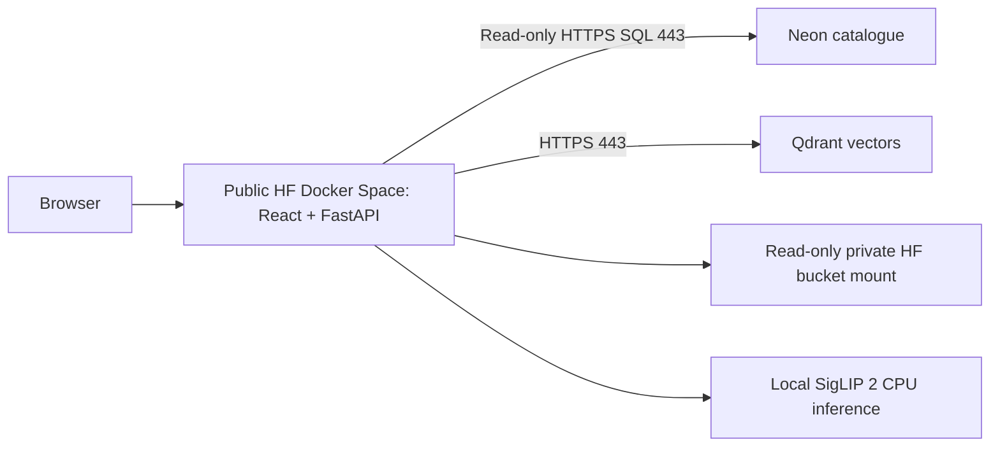

# Hugging Face Spaces deployment

The first release serves public collection search and dataset exploration.
React and FastAPI run together in one Docker Space; Neon stores
the catalogue, Qdrant Cloud stores vectors, and SigLIP 2 runs on the app CPU.
Chat, Image Studio, and image generation are outside this deployment.
The separate web edition uses Codex for agentic collection search;
see the [version and harness decision](product_versions.md). The default Docker
build is the dedicated search artifact and cannot enable agent features.
Searches have no daily quota.

The 100-image local preview is complete. No Space or HF storage bucket has been
created. Hosted setup is deferred until the deployment account and hardware are
selected. Update the checklist with evidence from the target Space before
marking hosted work complete.



## Remaining deployment work

| Order | Work | Completion check |
| --- | --- | --- |
| 1 | Prepare the HF image bucket and model cache. | Upload the 100 sample images with unchanged relative paths and checksums. Prepare pinned weights outside the app image. |
| 2 | Publish the SigLIP sample to the chosen cloud catalogue and Qdrant collection. | Model, revision, dimensions, image IDs, and active generation match. Text, uploaded-image, similar-image, and filtered searches return the expected sample results. |
| 3 | Create a public Space and configure secrets, storage, and connections. | Confirm account plan eligibility. Images and weights load from the selected storage. Authenticated Qdrant and Neon HTTPS reads on 443 succeed. Apply migrations from the operator environment before deployment; validate reconnection. |
| 4 | Verify public access and release scope. | Signed-out users can use pages, images and search endpoints. Agent APIs and Studio are absent. Bucket and database credentials remain server-side. |
| 5 | Validate hosted capacity and recovery. | Measure cold starts, memory, concurrent searches, and image delivery; check mobile flows, logs, a Space restart, and rollback. Record the deployed revision. |

## Later dataset publication

Publish the collection datasets on Hugging Face as a later release.
Follow the [publication plan](../data_spec.md#planned-hugging-face-dataset-publication)
to prepare the exporter, dataset card, metadata, and image files. Select the
owning namespace, release scope, and package format during that work. Verify
the published files, checksums, associations, and image loading from a clean
environment, and record the dataset revision with the matching search generation.

The Space can continue serving the same files through its read-only HF bucket
mount. Its image API is public even if the bucket is private. Direct browser
delivery from public HF dataset URLs can be evaluated during publication.

## Container packaging

The root [Dockerfile](../Dockerfile) installs only the `frontend` workspace with
`bun install --frozen-lockfile --filter './frontend'`, then builds it with Bun.
The root Neon CLI dependencies are for local database setup and are excluded
from the Docker build installation. The Python build installs
backend dependencies exported from `uv.lock` with exact versions and verified
hashes. The default search artifact excludes OpenAI, Codex, MCP and Gemini SDKs,
agent Python modules, Studio routes and agent frontend chunks. The runtime uses
Python 3.12, UID 1000 and one Uvicorn process on `0.0.0.0:7860`.
`EDITION=web` and `EDITION=studio` build separate artifacts; neither is used for
the HF search release.
The root README declares `sdk: docker` and `app_port: 7860` for
[Docker Spaces](https://huggingface.co/docs/hub/spaces-sdks-docker).

[`.dockerignore`](../.dockerignore) excludes local data, weights, environment
files, credentials, and installed dependencies. Build from the repository root:

```sh
docker build --platform linux/amd64 -t multimodal-space:local .
```

BuildKit caches downloads. A complete wheel mirror can be supplied with
`--build-arg UV_FIND_LINKS=URL --build-arg UV_NO_INDEX=true`; hash verification
still applies. Runtime configuration is injected through environment variables.

For an empty-catalogue startup check, use the disposable
[smoke stack](../deploy/compose.smoke.yml):

```sh
docker compose -f deploy/compose.smoke.yml up -d --wait --wait-timeout 180
# Check http://127.0.0.1:7860 and /api/v1/status, then remove the fixtures.
docker compose -f deploy/compose.smoke.yml down --volumes
```

This stack runs a separate migration container before starting the search API
against disposable PostgreSQL and Qdrant services.
The ready-index check uses the separate preview below. Both stacks publish port
7860, so stop one before starting the other.

## Local 100-image preview

Use [the local Compose stack](../deploy/compose.local.yml) with
[fixture settings](../deploy/local-preview.env). It creates a separate PostgreSQL
catalogue and Qdrant collection on localhost ports 15432 and 16333. The app uses
port 7860. Use these fixture services independently of the shared catalogue and index.

Start the databases, then select 100 images from your existing local source
files. Replace the two `/absolute/path` arguments with the extracted image root
and bronze object JSON export. Preserve the selected files' relative paths.

```sh
docker compose -f deploy/compose.local.yml up -d postgres qdrant
IMAGE_ROOT=/absolute/path/to/images uv run --locked --env-file deploy/local-preview.env \
  --package multimodal-backend cronjob/index_images.py \
  --limit 100 --scan-limit 5000 --seed 42 \
  --metadata /absolute/path/to/object_records.json --prepare-only
```

The command prints a run ID and writes
`data/local-preview/search/selections/RUN_ID.jsonl`. Copy only those selected
files into the preview image directory, retaining attribution in the catalogue:

```sh
python3 - /absolute/path/to/images RUN_ID <<'PYTHON'
import json
import shutil
import sys
from pathlib import Path
source = Path(sys.argv[1]).resolve()
snapshot = Path('data/local-preview/search/selections') / (sys.argv[2] + '.jsonl')
for line in snapshot.read_text().splitlines():
    relative = json.loads(line)['relative_path']
    origin = (source / relative).resolve()
    assert origin.is_relative_to(source)
    target = Path('data/local-preview/images') / relative
    target.parent.mkdir(parents=True, exist_ok=True)
    shutil.copyfile(origin, target)
PYTHON
uv run --locked --env-file deploy/local-preview.env --package multimodal-backend \
  cronjob/index_images.py --resume RUN_ID --workers 1 --batch-size 8
docker build --platform linux/amd64 -t multimodal-space:local .
docker compose -f deploy/compose.local.yml up -d --wait --wait-timeout 180
```

The indexer downloads and caches the pinned model on its first embedding call.
The app reuses that model cache and the 100-image directory through read-only
mounts. No source data or weights are copied into the image. Open
`http://127.0.0.1:7860`. After changing model settings, rebuild the corresponding
index and restart the app. To run the API directly on the host instead, use:

```sh
uv run --locked --env-file deploy/local-preview.env --package multimodal-backend \
  uvicorn app.main:app --host 127.0.0.1 --port 7861
```

Stop this preview with `docker compose -f deploy/compose.local.yml down`;
the named database volumes and local sample/model files remain for the next run.
The fixture database credentials are for local use only. Public access and
server-side secret handling will be verified during hosted deployment.

### Run both editions against the same index

After preparing the sample and building the search image, build the web image
and enable the Compose profile:

```sh
docker build --platform linux/amd64 --build-arg EDITION=web -t multimodal-web:local .
mkdir -p data/local-preview/web-state
docker compose -f deploy/compose.local.yml --profile web up -d --wait --wait-timeout 180
```

Search runs on port 7860 and web on port 7862. Both inherit one set of collection
settings and read-only image/model mounts; both use `smg_images_siglip2_preview`
in the same Qdrant server and the same PostgreSQL catalogue. No second indexing
run is needed. The web profile stores private conversation state in
`data/local-preview/web-state` and reads its optional `EXPLORER_` credentials
from the Compose environment or root `.env`. Ordinary search works without
model credentials; login and Codex turns require the [web settings](product_versions.md#run-the-web-edition).
Register `http://127.0.0.1:7862/api/v1/explorer/auth/callback` for this preview.

Stop both editions with
`docker compose -f deploy/compose.local.yml --profile web down`.
Keep the data volumes to reuse the published index and private conversation state.

## Local validation

Validated on 26 September 2026 with 100 real collection images:

- A separate PostgreSQL catalogue and `smg_images_siglip2_preview` collection
  contain the matching image metadata and 768-dimensional vectors.
- All 100 image API responses match the selected files' SHA-256 checksums.
  Camera, locomotive, medal, and saddle queries return matching objects first;
  an uploaded source image returns itself first. Filters and similar-image
  exclusion pass.
- The Linux amd64 container runs offline with read-only image and model mounts.
  Replacing the app container preserves the ready index and reloads the model.
- Desktop and mobile browser checks cover text search, image upload, details,
  the local-processing notice, and hidden agent controls.
- 250 Python tests, including the real Qdrant integration check, 28 browser tests,
  Ruff, Biome, and the frontend build passed.

The 4 October 2026 regression check passed 282 Python tests with PostgreSQL and
Qdrant, 32 browser tests, Ruff, Biome, and the frontend and Linux amd64 Docker
builds for search, web and Studio. OpenAPI and client regeneration produced no
changes. All three containers passed startup and route checks against a fresh
PostgreSQL catalogue and Qdrant.

The rebuilt search container has no OpenAI, Gemini, Gemini tracing, or S3 SDK
dependencies. Its source allowlist and fixed search entry point exclude agent models and
provider runtimes regardless of environment flags.
The ready SigLIP index and all 100 image checksums survive the container update;
text search, upload self-matching, and similar-image exclusion pass. Browser
checks verify that search-only pages do not download chat or Image Studio modules.

The web edition's separate Codex integration and local validation are documented
in [product versions](product_versions.md). Live model compatibility and HF
bucket access still need hosted validation.

Measured container latency was 8.86 seconds for the cold text request,
219–227 ms for sampled warm text queries, and 724 ms for image search. Docker
reported about 1.45 GiB of memory after the requests. These measurements include
amd64 emulation on a Mac; hosted capacity and broader relevance still need
assessment. Generated reports and screenshots are under `data/local-preview/`.

## Database connections

Set `QDRANT_URL=https://your-cluster-host:443` explicitly. The Python client uses
6333 when an HTTPS URL omits its port. Qdrant documents REST access on 443 in its
[cluster guide](https://qdrant.tech/documentation/cloud/create-cluster/).
Authenticated reads from the target Space remain to be tested.

Set `CATALOGUE_TRANSPORT=neon_http` in the HF search Space. Keep the original
PostgreSQL `DATABASE_URL`, including its database/user/password and optional
port 5432. The Python adapter derives `https://<Neon-host>/sql` on port 443 and
passes the connection string in a server-side credential header. It uses our
existing HTTPX dependency, parameterized SQL and read-only transactions. Requests
have bounded connection/read timeouts, do not follow redirects, and return
sanitized catalogue errors. The endpoint must be a Neon `ep-…neon.tech` host.
No native PostgreSQL connection is opened by the search API in this mode.

Neon limits each HTTP response to 64 MB. Catalogue scans use separate requests
of at most 500 rows, continuing after the last ID rather than an offset.
Filter options read paged distinct labels and SQL year aggregates, so the full
association descriptions and attribution are not downloaded to build the filters.

`CATALOGUE_TRANSPORT=postgres` is the default for local PostgreSQL and the web
edition. It uses SQLAlchemy/psycopg. Both transports execute the queries in
`backend/app/services/catalogue.py`; filtering, identifiers, attribution and
Qdrant retrieval stay shared. The web edition requires native PostgreSQL for
conversation transactions and its persistent supervisor lock. Its host must
permit native PostgreSQL connections.

The search API never applies catalogue migrations during startup. Run
`make migrate` with operator credentials and a direct `DATABASE_URL_UNPOOLED`
from a machine that can reach PostgreSQL, then publish the index before starting
or updating either API. Indexing still applies migrations before a run. Give the
HF runtime a catalogue reader role; it needs SELECT on `service_state`,
`index_generations`, `images` and `image_associations`, plus schema USAGE. The HF
runtime does not need `DATABASE_URL_UNPOOLED` or schema-writing permissions.

HTTPS/native parity is tested against disposable PostgreSQL using a Neon protocol
stand-in, including JSONB filters, pagination, image lookup, attribution, text,
image and similar search. Tests also impose a response byte limit, verify complete
results across pages, and cover failures after an earlier page succeeds.
Tests reject credential redirects and sanitize transport
failures. Actual Neon HTTPS access and restart behaviour from an HF Space remain
hosted acceptance checks. Native Neon connections passed earlier host/Linux tests;
changing psycopg's connection port to 443 is not supported.

The HTTPS wire format follows the
[official Neon driver](https://github.com/neondatabase/serverless/blob/main/src/http/index.ts).
HF documents HTTPS egress on 443 in its
[networking overview](https://huggingface.co/docs/hub/spaces-overview#networking).

## Storage and configuration

Space files can disappear on restart. Keep the catalogue, vectors, and source
images outside the app container, and prepare a reusable model cache.
[HF persistence](https://huggingface.co/docs/hub/spaces-sdks-docker#data-persistence).

| Purpose | Runtime configuration |
| --- | --- |
| Catalogue | `CATALOGUE_TRANSPORT=neon_http`; secret `DATABASE_URL` for a Neon catalogue reader. Keep its original PostgreSQL URL. |
| Vectors | `QDRANT_URL`, secret `QDRANT_API_KEY`, and `QDRANT_COLLECTION_NAME` matching the catalogue generation. |
| Model | `EMBEDDING_MODEL=google/siglip2-base-patch16-224`, pinned revision, 768 dimensions, and `EMBEDDING_MODEL_CACHE`. Use `HF_HUB_OFFLINE=1` only with a prepared cache. |
| Images | `IMAGE_ROOT=/app/data/images` pointing to the read-only HF bucket mount. |
| Release | Default `EDITION=search` build; one Uvicorn worker for the preview. |
| Telemetry | `LOGFIRE_SEND_TO_LOGFIRE` and secret `LOGFIRE_TOKEN` when exporting traces. |

Credentials belong in HF Secrets; Variables hold public configuration.
[Environment settings](https://huggingface.co/docs/hub/spaces-overview#managing-secrets-and-environment-variables).
Check [data and licensing requirements](../data_spec.md) before exposing images.

### Image storage

Use a private [HF Storage Bucket](https://huggingface.co/docs/hub/storage-buckets)
attached as a read-only volume. The app reads it through `IMAGE_ROOT` and serves
images through the API. No bucket has been provisioned or tested yet.

After selecting the owning HF account, authenticate the `hf` CLI and create the
private bucket. Replace `NAMESPACE/BUCKET` with the chosen bucket ID:

```sh
uv run hf auth login
uv run hf buckets create NAMESPACE/BUCKET --private
uv run hf buckets sync data/local-preview/images hf://buckets/NAMESPACE/BUCKET --dry-run
uv run hf buckets sync data/local-preview/images hf://buckets/NAMESPACE/BUCKET
```

The directory contents go at the bucket root, preserving every catalogue
`relative_path`. The commands add or update files; they do not remove other files.
Keep attribution and licences in the matching PostgreSQL catalogue.

In Space Settings, attach the bucket at `/app/data/images` with read-only access
and set `IMAGE_ROOT=/app/data/images`. HF manages the mount; the search app needs
no object-storage credentials. Its image endpoint serves bytes from this path
with private browser caching. Missing images return 404. See
[Space volumes](https://huggingface.co/docs/hub/spaces-storage).

Verify all 100 images through the API against their catalogue checksums, test
concurrent image requests, and repeat after replacing the app. Changing the mount
location while preserving relative paths and bytes does not require new vectors.
The local Compose fixture exercises the same path using a read-only bind mount.

### Model cache and capacity

SigLIP 2 Base uses revision `75de2d55ec2d0b4efc50b3e9ad70dba96a7b2fa2`,
safetensors, 768 dimensions, and two CPU threads. Weights occupy about 1.5 GB;
allow additional RAM for loading and inference. The local preview mounts its
prepared cache read-only. Choose and test the hosted cache location before rollout.
[Model card and licence](https://huggingface.co/google/siglip2-base-patch16-224).

The adapter serializes model work and processes at most eight images per forward
pass. The search service allows four concurrent requests per process. These
capacity controls bound simultaneous work; there is no daily search counter.
Changing model, revision, dimensions, or preprocessing requires a matching new
index. Never combine vectors from different embedding configurations.

## Public access and hosted acceptance

Use a public Space for open dataset exploration. Its source and running app are
public. Select the owning account or organization and confirm plan and hardware
eligibility: current HF documentation requires a paid plan to create Docker
Spaces, while CPU Basic has no hourly compute charge.
[Space visibility and creation](https://huggingface.co/docs/hub/spaces-overview).

The read-only bucket mount protects storage credentials, not the privacy of images
served through the public API. Include only the intended collection release,
with its licence and attribution fields. Set database and HF credentials through
Space Secrets and restrict catalogue access to the operations the app needs.

Use the HF Space page as the initial entry point. Verify signed-out access to
pages, images and direct search APIs, plus the absence of agent and Studio routes.
Then test text, upload, similar-image search, filters, details, mobile layouts,
database reconnects, and a Space restart. Measure cold starts, memory, concurrent
requests, and image delivery on the selected hardware. Record the Space revision,
matching index generation, and rollback procedure.
