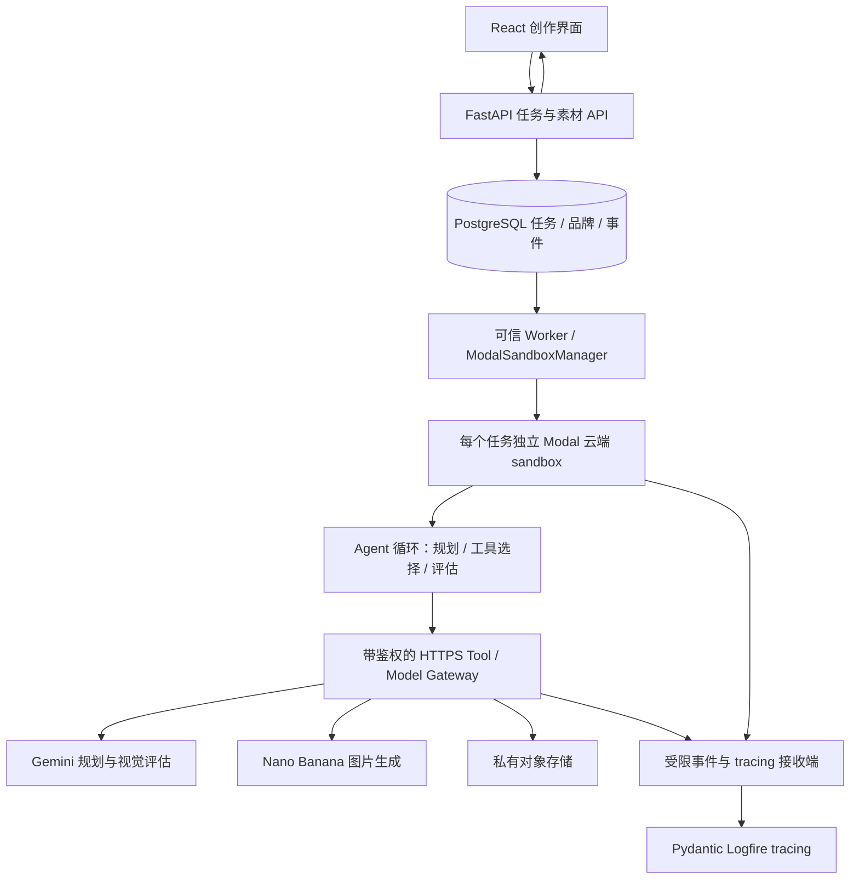

# 初期图片生成设计（历史方案）

以聊天为主的产品流程已实现，详见[聊天 Agent 后端](chat_agent_backend.CN.md)。新的会话 API 和馆藏 ID 桥接替代下文单次生成主流程；既有创作页面保持不变。

[English](image_agent_design.md) | 简体中文

英文版是主文档；本中文版本与英文版同步维护。

日期：2026-09-19。状态：实现已加入，真实云端 smoke 验证待完成。可执行命令和部署要求见[英文配置指南](image_agent_setup.md)。

已确定使用 **Modal Sandboxes** 在云端运行 agent，**Gemini / Nano Banana** 提供模型能力，**Pydantic Logfire** 提供 agentic tracing。公司风格通过品牌说明和参考图片定义。部署目标为云端，开发阶段也使用真实 Modal sandbox。目前已加入独立运行时、可信 API／Worker、Modal 部署定义和创作界面；真实 Modal／Gemini／Logfire 验证仍需云服务配置。

## 用户体验

用户创建品牌风格，填写品牌说明、配色、应保留和应避免的视觉元素，上传参考图片。用户保存不可变的品牌版本；规划模型在生成时解释说明与参考图片，当前不包含独立的品牌规范自动提取界面。

用户进入 `/create` 的 Image Studio，上传主体图片或输入文字需求。馆藏详情入口需实现素材用途授权和云端搜索连接后再接入。选择品牌风格、尺寸和候选数量后，系统创建异步任务。界面显示理解需求、选择参考、生成、检查和完成等进度，并允许取消。结果展示候选图、参考来源、检查摘要和下载入口。用户选定一个结果后，可以输入「保留主体，把背景换成品牌蓝」等要求继续修改。

图片输入明确标注角色：主体参考决定保留什么，风格参考决定如何表现。主体保留程度和品牌风格强度首期提供低、中、高选项，映射为提示词约束，不宣称是模型原生的精确数值控制。

MVP 默认生成 2 个候选，每个任务最多额外修订 1 个候选。首期一个工作空间、一个已认证操作者，可管理多个品牌。上传图片和文字生成无需现有 Qdrant 索引；馆藏检索保留为可选集成，首期未作为 agent 工具开放。

## 架构



Agent 的状态循环、模型响应处理、工具选择、参考选择和评估决策全部运行在 sandbox 内。模型推理由外部 Gemini API 完成；sandbox 内的模型客户端通过网关发起调用。网关负责校验、访问凭证、费用上限和 provider 调用，不代替 Agent 决策。

沿用 Python、FastAPI、SQLAlchemy/Alembic、google-genai 和 React。首期采用显式 Python 状态机、结构化规划／评估结果和有类型的网关工具请求；持久化状态与工具协议独立于特定 Agent 框架。一个 Agent 即可处理完整任务。

API 快速返回任务 ID；独立 Worker 领取 PostgreSQL 中的任务，默认并发 1，使用事务领取、租约、心跳和 attempt fencing 防止并发占用，网关拒绝过期执行实例的调用。进程重启后先核对已记录的 Modal sandbox ID 和执行实例，再从已提交的步骤恢复；不能仅因租约过期就启动第二个活跃 sandbox。Agent 从 Worker 管理的 sandbox 通过网关发起模型调用，长时间运行的编排不放进 FastAPI 提交请求或仅内存 BackgroundTasks。

## Agent 工作流

1. 解析用户需求，将主体、构图、风格、比例、文字要求变成结构化 brief。必要输入缺失时进入 `waiting_for_input`，释放 sandbox，补充后从 checkpoint 恢复。
2. 加载不可变的品牌版本。分析主体图，按任务选择最多 3 张风格参考；初次生成最多 4 张参考输入，修订时增加上一候选作为第 5 张输入，最终以所选模型能力约束为准。
3. 产出生成计划和提示词，明确哪些图片是主体参考、哪些是风格参考。
4. 调用 `generate_image`，分别保存候选与 provider 调用记录。
5. 检查文件可解码、尺寸、比例等确定性条件；再用视觉模型评估主体保留、品牌匹配和用户要求满足程度。
6. Agent 根据结构化检查结果选择完成或执行一次修订。达到预算仍不达标时返回已有结果并标记 `needs_review`，不无限重试。
7. 保存结果、参考关系、模型配置、检查摘要和 trace ID。后续编辑创建子任务，并关联父任务和选定图片。

运行时读取限定到当前任务的 manifest，包含需求、品牌版本和 checkpoint。网关操作为 `plan`、`generate`、`evaluate`、`wait` 和 `finish`。网关按 ID 加载已授权图片字节，模型不能指定任意文件路径或 URL。Pydantic 校验请求和模型输出。首期不开放馆藏检索、通用 shell 或安装软件工具。运行时根据结构化计划与评估结果决定补充询问、接受结果或修订候选。

品牌硬性字段由服务端验证，例如输入尺寸、参考权限、输出数量。视觉模型给出的评分是质量参考，不能保证主体、文字或 logo 的精确复现。首期不承诺像素级 logo 保真；需要精确品牌排版时另加确定性的后处理步骤。

## 模型接入

规划与视觉评估使用支持相应输入和工具调用的 Gemini 模型，分别通过 `AGENT_MODEL`、`AGENT_EVALUATION_MODEL` 配置。图片生成通过 `AGENT_IMAGE_MODEL` 配置，建议首选 `gemini-3.1-flash-image`（Nano Banana 2）。当前官方文档列出了该模型的图片生成、编辑和多参考输入能力。实施时用当前账号与锁定 SDK 做能力验证，再固定模型及 API 版本。[Google 图片生成文档](https://ai.google.dev/gemini-api/docs/image-generation)

Provider 适配器对上层提供统一的生成／编辑接口，返回图片字节或校验后的结构化结果，以及可用时的 usage；生成素材元数据保存模型和参考 ID。处理只有文字、拒绝、无图片、429、超时和损坏图片等响应。后续编辑以选定结果作为主体参考，发起新的生成请求；当前实现不重放 provider 会话或不透明签名。

规划模型返回结构化创作计划，评估模型返回接受／修订决定，由运行时验证并调用有类型的网关操作；当前实现不依赖模型原生 function calling。不能假定图片生成模型与规划模型具有相同的工具能力。[Google 工具调用文档](https://ai.google.dev/gemini-api/docs/function-calling)

首期每任务最多 8 次规划／评估调用、用户请求的 1–2 次生成及最多 1 次修订，每任务执行时限 10 分钟，另设有上限的启动等待时间。执行与启动时限可配置；调用预算由网关强制执行，并需通过真实小样本验证。网关使用持久化调用账本和原子预算预留，限制实际 provider 尝试数；评估调用和重试也计入总预算。限制工作空间并发量与运行时间；Modal 和存储实际费用在对应 provider 控制台查看。Provider 账本保存实际返回的 usage，未知时为 null；货币费用估算、每日消费额度和 Modal 账单核对暂未实现，界面不将估计值当作实际收费。

首期 provider 适配器将每次 SDK 调用限制为一次尝试，不自动重试付费请求。对生成请求发出后的连接中断，若 provider 无可查询的请求记录或幂等保证，标记 `outcome_unknown`，将任务置为失败并保留已完成的候选图；不自动再次付费生成。不承诺跨第三方 API 的 exactly-once。

## Sandbox 边界

使用 **Modal Sandboxes** 托管完整 Python agent 运行时。`ModalSandboxManager` 封装 `modal.Sandbox.create`、命令执行、状态检查和终止。每次任务执行从带版本的 `modal.Image` 创建全新 sandbox，镜像依赖锁定。初始配置 1 CPU、1 GiB 内存，无需 GPU，模型推理由 Gemini API 完成。显式设置 sandbox 生命周期为 10 分钟，同时由应用独立执行任务截止时间。[Modal Sandboxes](https://modal.com/docs/guide/sandboxes)

镜像只包含 agent 运行包，仓库、开发者 home、数据库和长期密钥留在外部。任务临时目录设置应用层的输入字节、输出字节和解码像素限制。不能假定 Docker 的 seccomp、挂载或 PID 参数可直接用于 Modal；实现时验证所选 SDK 支持的资源控制。

Sandbox 仅获得短期网关 token，绑定工作空间、任务、执行实例、允许操作及到期时间。Gemini、对象存储、数据库和 Logfire 凭证保留在可信服务中；部署在 Modal 的服务使用 Modal Secrets。Modal 资源创建凭证仅属于可信 Worker，sandbox 不获得创建其他 sandbox 的权限。[Modal Secrets](https://modal.com/docs/guide/secrets)

Modal 默认允许访问公网。配置出站白名单，仅允许应用 HTTPS 网关与 trace relay，不开放入站 tunnel 或 sandbox 公共服务。域名白名单当前为 Beta，依赖 TLS SNI，不校验 HTTP 路径，也不能阻止所有 domain fronting。因此，每个网关请求都要鉴权，只接受固定操作及当前任务的素材 ID。实现时在目标环境验证 SDK 网络控制；无法应用限制则启动失败。需要网关访问时，不能同时设置 `block_network=True`。[Modal 网络文档](https://modal.com/docs/guide/sandbox-networking)

接受工具调用前，持久化 `sandbox_id`、attempt ID、镜像版本、截止时间和生命周期状态。Checkpoint 和结果记录保存在 sandbox 外。创建请求结果不确定时先核对再重试；在平台支持时使用任务／执行实例元数据，并通过清理任务查找孤立资源。心跳与 fencing token 防止旧执行实例继续发起付费操作。

完成时先提交结果 checkpoint、flush 遥测，再终止 sandbox。取消时先撤销该实例 token，再请求终止并核对 Modal 最终状态。异常退出记录为 `sandbox_exit`，与 provider 失败分开；首期尚不单独识别内存耗尽。定期核对遗留 sandbox 和过期任务。等待用户补充信息时释放 sandbox，收到回复后从 checkpoint 启动新实例。已经提交的 Gemini 请求仍可能完成或计费。

云端部署将已认证 API、可信 Worker、网关和 trace relay 与 sandbox 执行区分开。建议首期在 Modal 部署 FastAPI／网关端点和 Worker，使用托管 PostgreSQL 与私有对象存储。Modal 支持 ASGI 应用；部署定义已加入，Worker 每 30 秒调度一次，具体命令见配置指南。[Modal Web Functions](https://modal.com/docs/guide/webhooks)

本地 UI 开发通过 HTTPS 调用已部署的开发 API／网关，远端 sandbox 无法调用开发者机器的 `127.0.0.1`。开发与生产使用不同 Modal 环境、数据库、存储命名空间和 Logfire 项目。真实云端部署和付费模型验证仍需完成服务配置。

## Agentic tracing

使用 **Pydantic Logfire** 做 agentic tracing 和链路查看，OpenTelemetry 保留为底层上下文与导出协议。Pydantic 数据校验本身不是 tracing 系统；本设计使用 Logfire SDK 接入现有 Google Gen AI SDK。配置 `logfire[google-genai]`，初始化 `logfire.configure()`，每个调用 Gemini 的可信进程启用一次 `logfire.instrument_google_genai()`；独立运行时使用显式 Logfire span 和自定义 OTLP exporter。任务、工具、评估和生命周期步骤使用显式 `logfire.span()`。验证所选 Gemini API 的自动采集覆盖，对未覆盖的调用补充显式 span。[Pydantic Google Gen AI 集成](https://pydantic.dev/docs/logfire/integrations/llms/google-genai/)

使用 Logfire 项目，将 `LOGFIRE_TOKEN` 保存在可信服务配置中。设置 `OTEL_INSTRUMENTATION_GENAI_CAPTURE_MESSAGE_CONTENT=NO_CONTENT`，导出前清理自定义 span 属性。可信服务将过滤后的元数据导出至 Logfire。Sandbox 使用任务 token 向带鉴权的应用 trace relay 发送 span，不获得 `LOGFIRE_TOKEN`。Relay 校验任务／执行实例范围、限制 payload、清理内容，保留 parent ID 并转发 OTLP span。应用已在 `backend/app/core/telemetry.py` 实现此 relay。

每个执行实例的 trace 从 Worker dispatch span 开始，数据库 run ID 关联提交与执行记录；首期不单独保存所有旧执行实例的 trace 历史。Worker 将 W3C trace context 注入 Modal sandbox，模型和工具调用通过 HTTPS 网关继续传递 parent context。Sandbox 内显式使用 Logfire span，Google Gen AI 自动采集放在实际发起 provider 调用的可信网关，避免对同一次调用重复采集。恢复后的新执行实例生成新的 trace ID，并保留相同业务 run ID。trace 示例：

```text
sandbox.dispatch
  agent.run
    agent.plan
      agent.gateway [operation=plan]
        [Google Gen AI model span]
    tool.generate_image
      agent.gateway [operation=generate]
        [Google Gen AI model span]
    tool.evaluate_image
      agent.gateway [operation=evaluate]
        [Google Gen AI model span]
    tool.generate_image [optional revision]
    tool.publish_result
```

业务记录保留 run／attempt ID、sandbox ID、镜像版本、品牌版本、父任务、provider 操作、usage、清理后的错误码和评估分数。Trace 保留执行关系和耗时；sandbox 元数据仅保留 run／attempt ID 与固定 span 标签。提示词模板版本、金额估算和完整 usage 面板仍待实现。保留决策摘要，例如「背景配色不符，执行一次修订」，不依赖或要求模型私有思维链。

默认只记录素材 ID、哈希、参数摘要与输出元数据，不导出原始品牌图片、完整提示词、base64、密钥或敏感 headers。完整任务内容留在受控业务存储中。当前实现禁用原始内容采集，不开放调试内容开关。

任务事件持久化到业务数据库，驱动用户可见进度；trace 负责诊断。trace 导出失败不丢失业务状态，在可信 relay 使用有界持久化缓冲重试，显示 tracing 降级状态。Sandbox exporter 只有有界临时缓冲，强制终止可能丢失最后的 span，因此以持久化任务事件为状态依据。sandbox 退出前 flush；异常退出由 Worker 记录未完成步骤及容器故障。

GenAI span 属性集中映射，避免语义约定变化影响业务逻辑。[OpenTelemetry GenAI agent spans](https://github.com/open-telemetry/semantic-conventions-genai/blob/main/docs/gen-ai/gen-ai-agent-spans.md)

## 数据与 API 契约

| 实体 | 主要字段 |
| --- | --- |
| BrandProfileVersion | brand_id、version、说明、配色、约束、参考素材 ID、创建时间 |
| Asset | id、workspace、kind、object_key、checksum、尺寸、mime、source |
| AgentRun | id、workspace、brand_version、request、status、stage、trace_id、sandbox_id、attempt_id、image_version、deadline、lease_until、checkpoint、result |
| AgentEvent | run_id、递增序号、类型、摘要、时间 |
| ProviderCall | run_id、step_id、operation、is_revision、request_hash、status、response、usage、error_code |
| 生成结果 | Asset 来源元数据关联任务与步骤；AgentRun checkpoint／result 保存候选 ID、评估和 review_status |

现有 `Generation` 表示搜索索引版本，Agent 表使用 `agent_` 前缀，生成文件使用 Asset 记录，评估和候选关系保存在运行 checkpoint／result 中。Agent 数据使用独立 PostgreSQL 数据库／schema 与 Alembic 迁移配置。图片字节存入私有对象存储，数据库记录 object key 和哈希。网关限制输入输出大小、验证内容，并将访问权限限定到当前任务；sandbox 不获得全桶凭证。上传完成并持久化后才发布对应数据库记录，核对未完成上传且不展示半成品。本地测试可以使用 `data/agent/assets/` 与 SQLite 适配器，但不能作为云端生产存储。现有搜索数据独立保留；馆藏工具在搜索服务和素材可由云端网关访问前保持关闭。

状态：`queued → starting → running → succeeded / failed / cancelled / timed_out`；`running → waiting_for_input → queued`（启动新执行实例）。`stage` 表达正在规划、生成或检查；`review_status=needs_review` 表达质量待确认，不与执行成功混为一谈。

| API | 用途 |
| --- | --- |
| POST /api/v1/agent/assets | 上传主体或品牌参考图，校验类型、大小与像素数 |
| POST /api/v1/agent/brands | 创建品牌与初始版本 |
| POST /api/v1/agent/brands/{id}/versions | 保存新版本；已运行任务的旧版本保持可读 |
| GET /api/v1/agent/brands | 列出品牌供选择 |
| POST /api/v1/agent/runs | 创建任务，Idempotency-Key 防止重复点击建任务 |
| GET /api/v1/agent/runs/{id} | 状态、候选结果、检查摘要 |
| GET /api/v1/agent/runs/{id}/events | SSE 进度，使用事件序号支持重连 |
| POST /api/v1/agent/runs/{id}/input | 补充等待中的信息 |
| POST /api/v1/agent/runs/{id}/cancel | 取消运行 |
| GET /api/v1/agent/assets/{id}/file | 下载经服务端授权的输入或输出 |

任务创建参数包含 brand_version、prompt、subject_asset_ids、aspect_ratio、candidate_count，以及可选 parent_run_id 和选定输出 ID。同一个幂等键带不同参数返回冲突。工作空间来自服务端上下文；首期使用绑定服务端工作空间的单操作者凭证，不信任客户端 company_id；成员管理和 SSO 留作后续扩展。

首期云端部署要求签名操作者会话或已配置 bearer 凭证、服务端分配的工作空间、存储隔离、队列／并发限制与网关鉴权。单工作空间 MVP 不等于已具备企业多租户安全，开放其他公司前覆盖跨工作空间访问测试。

馆藏素材保留现有 record/image ID、licence、copyright、credit 与来源。当前 `data_spec.md` 记录了 NC、ND 和许可缺失的素材；检索成功不自动赋予生成用途资格。MVP 以用户上传的品牌和主体素材打通链路；馆藏生成入口仅对另有明确用途授权记录的素材开放。所有生成结果保留来源关系，不自动写回官方馆藏索引。

## 代码位置

| 位置 | 职责 |
| --- | --- |
| backend/app/agent_runtime/ | 独立 Python 运行包、Agent 循环、工具客户端、提示词与状态定义 |
| backend/app/api/routes/agent.py | 品牌、素材与运行 API |
| backend/app/services/agent/ | 任务、网关、provider、sandbox 管理和 Worker |
| backend/app/agent_models.py | Agent 业务模型 |
| backend/app/agent_alembic/ | Agent 数据库迁移 |
| frontend/src/components/creation/ | 品牌表单、生成表单、进度、候选与编辑 |
| deploy/modal_app.py | Modal 镜像、可信服务与开发／生产部署定义 |
| backend/app/services/agent/modal_sandbox.py | Modal 创建、状态核对、取消与清理 |
| backend/app/core/telemetry.py | Pydantic Logfire 初始化、内容过滤与 span 辅助函数 |

## 实现顺序与验收

第一步完成一条真实竖切链路：上传品牌说明与参考、提交需求、真实 Modal sandbox 运行 Agent、通过网关真实生成一张图、保存结果、Pydantic Logfire 查到跨进程 trace。先用假 provider 验证恢复与隔离，再用配置好的 API key 做受预算约束的小样本验证。

第二步加入双候选、视觉评估、一次修订、用户追问编辑、幂等与取消恢复。第三步接通已获用途授权的馆藏素材选择，以及前端完整操作流程。

验收包括：Modal sandbox 中运行实际 Agent 循环并记录 sandbox ID；不可访问宿主密钥、其他任务素材或任意外网；超时与取消可以终止 sandbox，Worker 重启后可恢复；断线不重复创建任务；生成调用结果不确定时不盲目重试；无图／拒绝／429 等失败可解释；SSE 重连可恢复；trace 可串起模型调用、工具与修订；敏感素材未进入默认 trace；tracing 不可用时业务结果仍保留。

Python 修改运行 pytest 与 Ruff，前端完成类型检查、构建和浏览器流程验证。视觉效果用真实品牌说明和参考组成小型样本集，由用户评估主体保留、品牌一致性及修改满足程度，不以 LLM 自评分代替验收。

README、配置指南、数据规范和中英文设计文档已同步实现。自动测试使用外部服务替身，不代表已验证生产网络隔离或真实图片生成。真实验证需要有 sandbox 权限的 Modal 工作空间、Gemini key、Logfire 项目，以及开发用 PostgreSQL／对象存储。Agent sandbox 执行不依赖本地 Docker。上传参考图片的生成链路可以独立于馆藏索引验证。第一次付费小样本前，验证 Modal SDK／API 版本、HTTPS 网关可达性、网络限制、素材持久化和 trace 传播。
