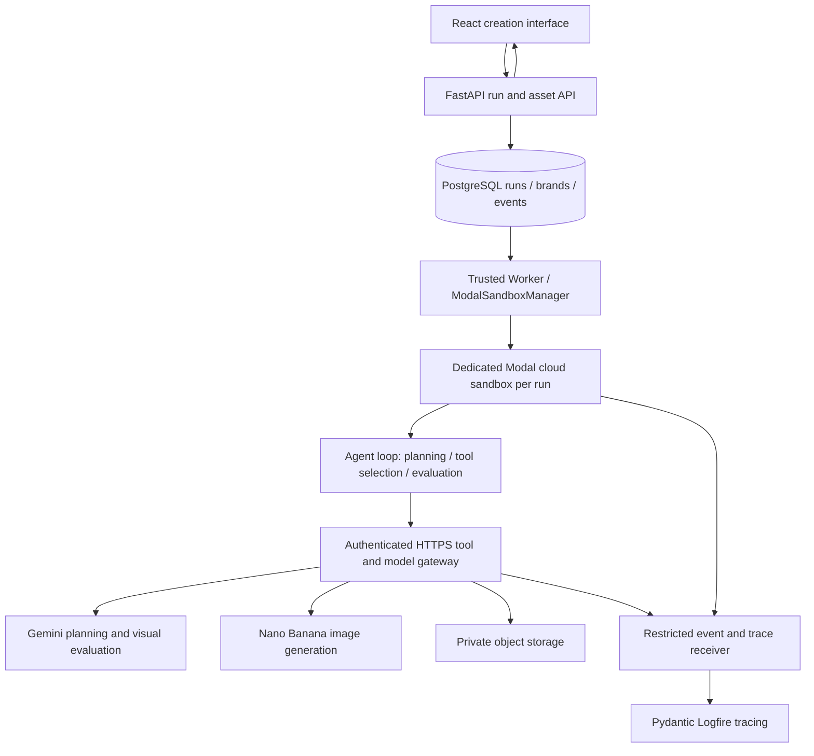

# Initial image generation design (historical)

The conversation-first backend is implemented in [Brand chat agent backend](chat_agent_backend.md). Its conversation API and collection-ID bridge supersede the single-run product flow below; the existing creation UI remains unchanged.

English | [简体中文](image_agent_design.CN.md)

This is the primary document. Keep the Chinese version aligned with it.

Date: 2026-09-19. Status: historical single-run design. The linked chat backend guide describes the current product flow. See [setup and validation](image_agent_setup.md) for runnable commands and deployment requirements.

The selected stack is **Modal Sandboxes** for cloud agent execution, **Gemini / Nano Banana** for model capabilities, and **Pydantic Logfire** for agentic tracing. Brand descriptions and reference images define company style. The deployment target is the cloud; development also uses real Modal sandboxes. The module now includes the portable runtime, trusted API/worker, Modal deployment definitions, and creation UI. A real Modal/Gemini/Logfire run still requires configured cloud services.

## User experience

Users create a brand profile with a description, colors, visual elements to retain or avoid, and reference images. Users save immutable profile versions. The planning model interprets the profile and references during generation; a separate automatic brand-profile extraction UI is not included.

Users open Image Studio at `/create`, upload a subject image, or enter a text request. Collection detail integration remains unavailable until asset usage authorization and cloud search connectivity are implemented. Selecting a brand, output size, and candidate count creates an asynchronous run. The interface shows progress through understanding the request, selecting references, generating, evaluating, and completing, and allows cancellation. Results include candidates, reference sources, evaluation summaries, and downloads. Users can select a result and request changes such as “Keep the subject and change the background to our brand blue.”

Inputs have explicit roles: subject references specify what to preserve; style references specify how to depict it. The first release offers low, medium, and high settings for subject preservation and brand style strength. These map to prompt constraints, not precise native model controls.

The MVP generates 2 candidates by default and permits at most 1 additional candidate revision per run. It supports one workspace with one authenticated operator and multiple brands. Uploaded images and text generation work without the existing Qdrant index. Collection search is reserved as an optional integration; the first implementation does not expose it as an agent tool.

## Architecture



The agent state loop, model response handling, tool selection, reference selection, and evaluation decisions all run inside the sandbox. External Gemini APIs perform inference; the model client inside the sandbox makes requests through the gateway. The gateway handles validation, credentials, spending limits, and provider calls. Agent decisions remain inside the sandbox.

Reuse Python, FastAPI, SQLAlchemy/Alembic, google-genai, and React. Agent tables have independent SQLAlchemy metadata and migrations. Start with an explicit Python state machine with structured planning/evaluation responses and typed gateway tool requests. Keep persisted state and tool protocols independent of a particular agent framework. One agent handles the complete run.

The API returns a run ID promptly. A separate worker claims runs from PostgreSQL, with concurrency set to 1 by default. Transactional claims, leases, heartbeats, and attempt fencing prevent concurrent ownership. The gateway rejects calls from superseded attempts. After a restart, the worker reconciles the recorded Modal sandbox ID and attempt before resuming from committed step state. An expired lease alone must not start a second active sandbox. The agent initiates model calls from the worker-managed sandbox through the gateway. Long-running orchestration stays outside the FastAPI submission request and in-memory BackgroundTasks.

## Agent workflow

1. Parse the request into a structured brief covering subject, composition, style, aspect ratio, and text requirements. If required information is missing, enter `waiting_for_input`, release the sandbox, and resume from a checkpoint after the user responds.
2. Load an immutable brand version. Analyze the subject image and select up to 3 style references. Initial generation accepts at most 4 reference inputs; revision adds the previous candidate as a fifth input. These limits remain subject to the selected model's capabilities.
3. Produce a generation plan and prompt with explicit subject and style reference roles.
4. Call `generate_image`, saving each candidate and its provider call record separately.
5. Check deterministic conditions, including decoding, dimensions, and aspect ratio. Then use a vision model to evaluate subject preservation, brand alignment, and satisfaction of the user's request.
6. Use the structured evaluation to finish or make one revision. If the budget is exhausted before the quality target is met, return existing results with `needs_review` rather than retrying indefinitely.
7. Save outputs, reference relationships, model configuration, evaluation summaries, and the trace ID. Subsequent edits create child runs linked to the parent run and selected image.

The runtime reads a task-scoped manifest containing the brief, brand version, and checkpoint. Its typed gateway operations are `plan`, `generate`, `evaluate`, `wait`, and `finish`. The gateway loads authorized image bytes by ID; the model cannot supply arbitrary file paths or URLs. Pydantic validates requests and model outputs. The first implementation exposes no collection search, general shell, or software installation tool. The runtime chooses whether to ask for clarification, accept results, or revise a candidate using the structured plan and evaluation.

The server validates hard constraints such as input dimensions, reference permissions, and output counts. Vision model scores provide quality guidance but cannot guarantee exact reproduction of subjects, text, or logos. The first release does not promise pixel-perfect logo preservation. Exact brand layout would require an additional deterministic postprocessing step.

## Model integration

Planning and visual evaluation use Gemini models supporting the required inputs and tool capabilities, configured through `AGENT_MODEL` and `AGENT_EVALUATION_MODEL`. Configure image generation with `AGENT_IMAGE_MODEL`; the recommended starting model is `gemini-3.1-flash-image` (Nano Banana 2). Current official documentation lists generation, editing, and multiple reference inputs. During implementation, verify capabilities with the available account and locked SDK, then pin the model and API versions. [Google image generation documentation](https://ai.google.dev/gemini-api/docs/image-generation)

The provider adapter exposes a common generation/editing interface. It returns image bytes or validated structured output and usage when available. Stored generated asset metadata includes the model and reference IDs. Handle text-only responses, refusals, missing images, HTTP 429 responses, timeouts, and corrupt images. Follow-up edits make a fresh generation request using the selected prior output as a subject reference; the implementation does not replay a provider conversation or opaque signatures.

The planning model returns a structured creative plan, and the evaluation model returns an accept/revise decision. The runtime validates those results and executes typed gateway operations; native model function calling is not required by this implementation. Do not assume the image generation model and planning model support the same tools. [Google function calling documentation](https://ai.google.dev/gemini-api/docs/function-calling)

Initial limits are 8 combined planning/evaluation calls, the requested 1–2 generations plus at most 1 revision, and a 10-minute execution deadline per run, with a separate bounded startup allowance. Runtime and startup deadlines are configurable; call budgets are enforced in the gateway. Validate the limits with a small real sample. The gateway uses a persistent call ledger and atomic budget reservations to limit actual provider attempts. Evaluation calls and retries count toward the overall budget. Enforce workspace concurrency and runtime limits; inspect actual Modal and storage charges in their provider dashboards. The provider ledger stores reported usage, leaving unavailable usage null. Monetary estimates, daily spending quotas, and reconciliation with Modal billing are deferred; no cost estimate is shown as an actual charge.

The initial provider adapter sets one SDK attempt per call and does not automatically retry paid requests. If a connection breaks after a generation request was submitted and the provider offers neither a queryable request record nor an idempotency guarantee, mark the step `outcome_unknown` and fail the run while preserving completed candidates. Do not automatically submit another paid generation. Exactly-once execution across third-party APIs is not guaranteed.

## Sandbox boundaries

Use **Modal Sandboxes** to host the complete Python agent runtime. `ModalSandboxManager` wraps `modal.Sandbox.create`, command execution, status inspection, and termination. Create a fresh sandbox per run attempt from a versioned `modal.Image` with locked dependencies. Start with 1 CPU and 1 GiB of memory, no GPU; inference runs through Gemini APIs. Set the sandbox lifetime explicitly to 10 minutes and enforce the application deadline independently. [Modal Sandboxes](https://modal.com/docs/guide/sandboxes)

Package only the agent runtime into the image. Keep the repository, developer home, database, and long-lived credentials outside it. Use a task directory for temporary files, with application limits on input bytes, output bytes, and decoded pixels. Do not assume Docker-specific seccomp, mount, or PID flags are available in Modal. Verify the selected SDK's resource controls during implementation.

Give the sandbox a short-lived gateway token bound to workspace, run, attempt, permitted operations, and expiration. Store Gemini, object storage, database, and Logfire credentials in trusted services; use Modal Secrets for services deployed on Modal. Modal provisioning credentials belong only to the trusted worker. A sandbox receives no credential that can provision other sandboxes. [Modal Secrets](https://modal.com/docs/guide/secrets)

Modal permits public outbound traffic by default. Configure an outbound allowlist for the application's HTTPS gateway and trace relay, with no inbound tunnel or public sandbox server. Domain allowlisting is currently Beta and uses TLS SNI; it does not validate HTTP paths or prevent all domain-fronting cases. Therefore, authorize every gateway request and accept only fixed operations and task-scoped asset IDs. Verify the SDK's network controls in the deployment environment; fail startup if the configured restrictions cannot be applied. Do not combine `block_network=True` with the allowlist required for gateway calls. [Modal networking](https://modal.com/docs/guide/sandbox-networking)

Persist `sandbox_id`, attempt ID, image version, deadline, and lifecycle state before accepting tool calls. Checkpoints and output records live outside the sandbox. During provisioning, reconcile an uncertain create result before retrying; use run/attempt metadata where supported and a sweeper to find orphaned resources. Heartbeats and a fencing token make a superseded sandbox unable to perform new paid operations.

On completion, checkpoint outputs and flush telemetry before termination. On cancellation, revoke the attempt token first, request termination, and reconcile Modal's final state. Record unexpected sandbox exits as `sandbox_exit`, separately from provider failures; the first release does not classify out-of-memory exits separately. Periodically reconcile abandoned sandboxes and expired runs. Waiting for user input releases the sandbox; a later response creates a new attempt from the saved checkpoint. An already submitted Gemini request may still complete or incur charges.

Cloud deployment separates the authenticated API, trusted worker, gateway, and trace relay from sandbox execution. The deployment definition hosts FastAPI/gateway endpoints and a worker scheduled every 30 seconds on Modal, with managed PostgreSQL and private object storage. Modal supports ASGI applications; configuration commands are in the setup guide. [Modal web functions](https://modal.com/docs/guide/webhooks)

Local UI development calls a deployed development API/gateway over HTTPS. A remote sandbox cannot call the developer machine's `127.0.0.1`. Use a separate Modal development environment, database, bucket namespace, and Logfire project from production. Real cloud deployment and paid model verification remain pending service configuration.

## Agentic tracing

Use **Pydantic Logfire** for agentic tracing and the trace inspection UI. OpenTelemetry remains the underlying context and export protocol. Pydantic data validation alone is not a tracing system; this design uses the Logfire SDK with the existing Google Gen AI SDK. Configure `logfire[google-genai]`, initialize `logfire.configure()`, and enable `logfire.instrument_google_genai()` once per trusted process that calls Gemini. The portable runtime uses explicit Logfire spans and a custom OTLP exporter. Add explicit `logfire.span()` instrumentation for run, tool, evaluation, and lifecycle steps. Verify coverage of the selected Gemini API and add explicit spans where automatic instrumentation is incomplete. [Pydantic Google Gen AI integration](https://pydantic.dev/docs/logfire/integrations/llms/google-genai/)

Use a Logfire project and keep `LOGFIRE_TOKEN` in the trusted service configuration. Keep `OTEL_INSTRUMENTATION_GENAI_CAPTURE_MESSAGE_CONTENT=NO_CONTENT` and redact custom span attributes before export. Export filtered metadata from trusted services to Logfire. The sandbox sends spans to an authenticated application trace relay using its task token; it never receives `LOGFIRE_TOKEN`. Configure the relay to validate run/attempt scope, bound payloads, redact content, and forward OTLP spans while preserving parent IDs. The application implements this relay in `backend/app/core/telemetry.py`.

Each run attempt uses a trace rooted in the worker dispatch span. The database run ID links submission and attempt records. The initial implementation does not persist a separate trace history for all earlier attempts. The worker injects W3C trace context into the Modal sandbox, and model and tool requests propagate parent context through the HTTPS gateway. Run explicit Logfire spans inside the sandbox and instrument Google Gen AI in the trusted gateway where provider calls execute. Avoid duplicate spans for the same call. A resumed attempt gets a new trace ID and retains the same business run ID. Example trace:

```text
sandbox.dispatch
  agent.run
    agent.plan
      agent.gateway [operation=plan]
        [Google Gen AI model span]
    tool.generate_image
      agent.gateway [operation=generate]
        [Google Gen AI model span]
    tool.evaluate_image
      agent.gateway [operation=evaluate]
        [Google Gen AI model span]
    tool.generate_image [optional revision]
    tool.publish_result
```

Application records retain run and attempt IDs, sandbox ID, image version, brand version, parent run, provider operation, usage, sanitized error codes, and evaluation scores. Trace spans retain execution relationships and timing; sandbox metadata is restricted to run/attempt IDs and static span labels. Prompt template versioning, monetary estimates, and a complete usage dashboard remain future work. Keep decision summaries such as “Background colors do not match; make one revision.” Do not depend on or request private model chain-of-thought.

By default, record only asset IDs, hashes, argument summaries, and output metadata. Do not export original brand images, complete prompts, base64 data, credentials, or sensitive headers. Full run content remains in controlled application storage. Raw content capture is disabled in this implementation; no debug-content toggle is exposed.

Persist run events in the application database to drive user-visible progress; use traces for diagnostics. Trace export failures must not lose application state. Retry through a bounded persistent buffer on the trusted relay and expose a degraded tracing state. The sandbox exporter has only a bounded transient buffer; a hard kill may lose its final spans, so persistent run events remain authoritative. Flush before sandbox exit. After an abnormal exit, the worker records unfinished steps and container failures.

Centralize GenAI span attribute mappings so semantic convention changes do not affect application logic. [OpenTelemetry GenAI agent spans](https://github.com/open-telemetry/semantic-conventions-genai/blob/main/docs/gen-ai/gen-ai-agent-spans.md)

## Data and API contracts

| Entity | Main fields |
| --- | --- |
| BrandProfileVersion | brand_id, version, description, colors, constraints, reference asset IDs, creation time |
| Asset | id, workspace, kind, object_key, checksum, dimensions, mime, source |
| AgentRun | id, workspace, brand_version, request, status, stage, trace_id, sandbox_id, attempt_id, image_version, deadline, lease_until, checkpoint, result |
| AgentEvent | run_id, increasing sequence number, type, summary, timestamp |
| ProviderCall | run_id, step_id, operation, is_revision, request_hash, status, response, usage, error_code |
| Generated result | Asset source metadata links run and step; AgentRun checkpoint/result retains candidate IDs, evaluations, and review_status |

The existing `Generation` entity represents a search index version. Agent tables use the `agent_` prefix. Generated files use Asset records, with evaluation and candidate relationships in the run checkpoint/result. Use a dedicated PostgreSQL database/schema and Alembic migration configuration for agent data. Store image bytes in private object storage and keep object keys and hashes in the database. The gateway reads bounded image payloads, validates content, and scopes every access to the run. The sandbox receives no bucket-wide credentials. Persist completed uploads before publishing their database records; reconcile incomplete uploads without presenting partial results. Local tests may use files under `data/agent/assets/` and SQLite adapters, but these are not cloud production storage. Existing search data remains separate; the optional collection tool stays disabled until its search service and assets are reachable from the cloud gateway.

States: `queued → starting → running → succeeded / failed / cancelled / timed_out`, with clarification following `running → waiting_for_input → queued` for a new attempt. The `stage` field describes planning, generation, or evaluation. `review_status=needs_review` indicates that quality requires review, separately from execution success.

| API | Purpose |
| --- | --- |
| POST /api/v1/agent/assets | Upload subject or brand reference images; validate type, size, and pixel count |
| POST /api/v1/agent/brands | Create a brand and its initial version |
| POST /api/v1/agent/brands/{id}/versions | Save a new version; retain readable versions used by existing runs |
| GET /api/v1/agent/brands | List brands for selection |
| POST /api/v1/agent/runs | Create a run; use Idempotency-Key to prevent duplicate submissions |
| GET /api/v1/agent/runs/{id} | Read status, candidates, and evaluation summaries |
| GET /api/v1/agent/runs/{id}/events | Stream progress over SSE, with event sequence numbers for reconnection |
| POST /api/v1/agent/runs/{id}/input | Supply information requested by a waiting run |
| POST /api/v1/agent/runs/{id}/cancel | Cancel a run |
| GET /api/v1/agent/assets/{id}/file | Download an input or output authorized by the server |

Run creation accepts brand_version, prompt, subject_asset_ids, aspect_ratio, candidate_count, and optional parent_run_id and selected output ID. Reusing an idempotency key with different arguments returns a conflict. Derive the workspace from server context. The first release authenticates one operator credential bound to the configured workspace. Never trust a client-supplied company_id. Membership management and SSO are future extensions.

The first cloud deployment requires a signed operator session or configured bearer credential, server-assigned workspace, storage isolation, queue/concurrency limits, and gateway authorization. A one-workspace MVP does not establish enterprise multitenancy; test access across workspaces before enabling additional companies.

Collection assets retain existing record/image IDs, licence, copyright, credit, and source. The current `data_spec.md` records assets with NC, ND, or missing licence values; successful retrieval does not automatically authorize generation use. The MVP uses uploaded brand and subject assets to establish the complete workflow. Enable collection generation only for assets with a separate record of explicit authorization for the intended use. Retain source relationships for every generated output and keep outputs out of the official collection index by default.

## Code locations

| Location | Responsibility |
| --- | --- |
| backend/app/agent_runtime/ | Standalone Python runtime, agent loop, tool client, and typed contracts |
| backend/app/api/routes/agent.py | Brand, asset, and run APIs |
| backend/app/services/agent/ | Runs, gateway, providers, sandbox management, and worker |
| backend/app/agent_models.py | Agent application models |
| backend/app/agent_alembic/ | Agent database migrations |
| frontend/src/components/creation/ | Brand and generation forms, progress, candidates, and editing |
| deploy/modal_app.py | Modal image, trusted services, and development/production deployment definitions |
| backend/app/services/agent/modal_sandbox.py | Modal provisioning, reconciliation, cancellation, and cleanup |
| backend/app/core/telemetry.py | Pydantic Logfire setup, content filtering, and span helpers |

## Implementation sequence and acceptance

First, complete one working path: upload a brand description and references, submit a request, run the agent in a real Modal sandbox, generate one real image through the gateway, save the result, and inspect a trace spanning the processes in Pydantic Logfire. Verify recovery and isolation with a fake provider first, then use a configured API key for a small real sample within the call budget.

Second, add two candidates, visual evaluation, one revision, follow-up edits, idempotency, cancellation, and recovery. Third, connect collection selection for assets with authorized usage and complete the frontend workflow.

Acceptance checks cover the actual agent loop running in a Modal sandbox with a recorded sandbox ID; blocked access to host credentials, other runs' assets, and arbitrary external networks; sandbox termination after timeout or cancellation and recovery after worker restart; no duplicate run creation after disconnection; no blind retries when generation outcomes are uncertain; understandable missing-image, refusal, and HTTP 429 failures; SSE recovery after reconnection; traces connecting model calls, tools, and revisions; no sensitive assets in default traces; and preserved application results when tracing is unavailable.

Run pytest and Ruff for Python changes. Complete frontend type checking, builds, and browser workflow verification. Evaluate visual quality using a small set of real brand descriptions and references. User assessment of subject preservation, brand consistency, and requested edits determines acceptance; model self-evaluation alone is insufficient.

The README, setup guide, data specification, and both language versions describe the implementation. Automated tests use fake external services; they do not prove production network isolation or successful real generation. Real verification requires a Modal workspace with sandbox access, a Gemini key, a Logfire project, and development PostgreSQL/object storage. Local Docker is not required for agent sandbox execution. Uploaded reference generation can be verified independently of the collection index. Validate the Modal SDK/API versions, HTTPS gateway reachability, network restrictions, asset persistence, and trace propagation before the first paid sample run.
