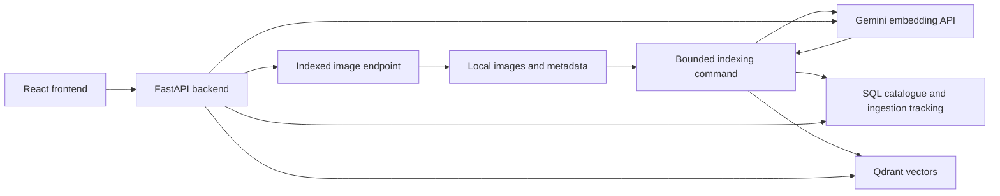

# Multimodal image search service

Status: the core prototype is implemented. See the [backend guide](../backend/README.md)
and [frontend guide](../frontend/README.md) for the current run commands. The initial
workflow selects 50 images and tracks each image through the SQL catalogue into Qdrant.

The [user feature document](user_features.md) describes what we want to build.
This specification covers the current image search service. Use the root [Makefile](../Makefile) and
[local run guide](../README.md#run-locally) to operate the prototype.

Build a web application for searching the Science Museum Group images already
stored under `data/images/`. A user enters a description or supplies an image
and receives matching collection images. Start with a bounded sample, persist
its embeddings, and expand the searchable collection through explicit indexing
runs.

## User experience

The home page shows a search field, an image upload control, and a grid of indexed
images. Display the number of searchable images and identify the collection as a
sample when a sample index is active.

Support these actions:

- Search by text, such as “a brass scientific instrument” or “a steam locomotive”.
- Upload an image to find visually or semantically similar collection images.
- Select “Find similar” on a result to search using its stored embedding.
- Filter browsing and every search by creation year range, creation place, and category.
- Open an image detail panel with its title, description, source identifiers,
  date, place, category, maker, and supplied licence and attribution information.

Return 24 results by default, with a maximum of 100 per search. Browse the sample
in pages of 24 images. Use responsive cards, lazy image loading, labelled controls,
keyboard navigation, and a visible loading state. Keep the current results visible
while another query runs and ignore responses from superseded requests.
Applying changed filters clears stale results and repeats the current search, or
refreshes browsing when no search is active. Populate place and category choices
from the active catalogue. The UI selects one value per field; the API accepts
multiple values. “Clear filters” retains the current query. Invalid year ranges
disable the apply button and show a correction message.

Provide clear states for an empty index, unavailable search, invalid uploads,
missing images, and zero results. Keep model names, vector dimensions, and local
filesystem paths in operator diagnostics. The user interface should explain that
uploaded query images are sent to Google to generate embeddings, which the app
uses to find similar collection images. Uploaded images are not added to the collection.

## Technology stack and project layout

Use the [Full Stack FastAPI Template](https://github.com/fastapi/full-stack-fastapi-template)
as the layout and integration reference. Record the upstream commit used when
scaffolding. Adapt its database configuration to Neon PostgreSQL and add Qdrant to
the Compose services.

| Layer | Technology | Project responsibility |
| --- | --- | --- |
| Backend | Python 3.12+, FastAPI, Uvicorn | HTTP routes, image delivery, and search orchestration. |
| Validation | Pydantic v2 and `pydantic-settings` | Typed requests, responses, and environment configuration. |
| Frontend | React, TypeScript, Vite | Search page, upload control, results grid, and image details. |
| UI and data fetching | Tailwind CSS, shadcn/ui, TanStack Router and Query | Components, navigation, and asynchronous API state. |
| API client | `@hey-api/openapi-ts` | Generate the frontend client from FastAPI's OpenAPI schema. |
| Catalogue database | Neon PostgreSQL, SQLModel, Alembic | Catalogue, ingestion status, retries, checkpoints, and schema migrations. |
| Vector database | Qdrant and `qdrant-client` | Persistent image vectors and cosine similarity queries. |
| Embeddings | Gemini Embedding 2 and `google-genai` | Image and text embeddings in a shared space. |
| Tracing | Pydantic Logfire and the `logfire[fastapi]` Python SDK | Trace API requests, AI calls, ingestion, and database operations. |
| Image validation | Pillow | Decode files and validate formats and dimensions. |
| Local services | Docker Compose | Run Qdrant and the application with persistent local storage. |
| Dependency management | uv and Bun | Python workspace and frontend dependencies with committed lockfiles. |
| Validation tools | pytest, Ruff, TypeScript, Biome, Playwright | Backend checks, frontend checks, and browser workflows. |

Follow the template's [backend conventions](https://github.com/fastapi/full-stack-fastapi-template/blob/master/backend/README.md)
and [frontend conventions](https://github.com/fastapi/full-stack-fastapi-template/blob/master/frontend/README.md).
The proposed project layout is:

```text
backend/
  app/
    main.py
    core/
      config.py
      db.py
    api/
      main.py
      deps.py
      routes/
        images.py
        search.py
        status.py
    models.py
    schemas.py
    crud.py
    services/
      selection.py
      embeddings.py
      ingestion.py
      qdrant_store.py
      search.py
    alembic/versions/
  tests/
  scripts/
  alembic.ini
  pyproject.toml
  Dockerfile
frontend/
  src/
    client/
    components/
    hooks/
    lib/
    routes/
  public/
  tests/
  package.json
  vite.config.ts
cronjob/
  index_images.py
  match_images.py
  silver_to_gold.py
scripts/
  generate-client.sh
docs/
data/
compose.yml
compose.override.yml
pyproject.toml
uv.lock
package.json
bun.lock
```

Add `backend` as a uv workspace member named `multimodal-backend`, exporting the
`app` Python package. The root Python project continues to own the existing data
scripts and their dependencies. Use a shared root `uv.lock` and `.venv`. Declare
backend dependencies in `backend/pyproject.toml` and select versions compatible
with this repository's Python requirement. Use the template's Bun workspace
convention for `frontend`.

Put catalogue table models in `models.py`, Pydantic API schemas in `schemas.py`, and
settings in `core/config.py`. Keep routes thin: service modules implement
selection, embedding, ingestion, and search. The cronjob entry point calls the
same ingestion service. Generate `frontend/src/client/` from the API schema and
regenerate it whenever an endpoint contract changes.

## Architecture

The React frontend calls FastAPI. FastAPI queries Qdrant for ranked image IDs and
scores, then joins those IDs to the SQL catalogue for display metadata.
The SQL catalogue records which image version has been successfully ingested into each
Qdrant collection. The separate indexing command updates both stores.



At startup, the API reads the active index version and its Qdrant collection name
from the SQL catalogue. It reads local image bytes when requested and keeps using that
generation until restarted. Indexing builds a new generation independently.

Use Vite during frontend development, with `/api/v1` proxied to FastAPI. Serve the
built React frontend through FastAPI for the local packaged application, following
the template. API and image routes take precedence over the frontend route fallback.
The browser accesses the SQL catalogue and Qdrant through the backend.

## Bounded data selection

Default to at most **50 distinct images**, with a scan limit of **1,000 source
records**. Both limits are configurable, up to 1,000 images and 10,000 records.
Maintain a bounded sample using a stable hash of the image location and seed 42
while streaming metadata. Decode only the selected candidates after the scan.
Failed embedding requests do not cause the selection to grow.

The existing optional manifest is
`data/processed/image_manifest.csv`. A future manifest input can stream eligible
rows with `status=matched`. The implemented sampler reads bronze metadata directly
and defaults to the object export.

For bronze selection, reuse the streaming record parser and metadata conventions
in [the matching script](../cronjob/match_images.py). Resolve each medium thumbnail
location against explicitly configured extraction roots, including the current
root `data/images/smg_all_medium_thumnail_images_09_04_2025/`. Test the complete
relative path under each root; multiple matches are ambiguous. Check containment
after resolving symlinks, and reject traversal or ambiguous paths.

Process configured source files in their supplied order and records in source order. Retain selected
record–image associations, including repeated references encountered before the
scan stops. Deduplicate vectors by normalized image location. This selection is a
repeatable development sample; it does not establish coverage of the collection.

Decode and validate selected images individually. Skip missing, corrupt,
unsupported, or unresolved-rights entries with a recorded reason. Use the
per-image rights fields and [the project's data guidance](../data_spec.md) when
selecting content for the intended use. Preserve supplied field values, including
empty strings and original licence spelling.

Write a selection snapshot before embedding. Store it under `data/search/` with
the source paths, selection parameters, counts, and image checksums. Reuse that
snapshot when resuming. Read metadata incrementally and decode at most the small
configured number of concurrent images. The full metadata and image collection
must not be loaded into memory or indexed during web application startup.

The gold Parquet remains available for later metadata enrichment. The initial
catalogue can be built from the selected bronze or manifest records, which carry
the image paths and rights fields needed by the service.

## Embedding contract

Use `gemini-embedding-2` through the existing `google-genai` dependency. Google
documents shared text and image embeddings and supports 1536 output dimensions,
which is the proposed default for this service.
[Source: Gemini Embedding 2](https://ai.google.dev/gemini-api/docs/models/gemini-embedding-2).

Generate one image embedding per selected image. Display metadata is stored in
the catalogue. Use the same model and dimension for query embeddings. Format text
queries as `task: search result | query: {text}`. Send image queries as image
content. Supply one image per embedding call to keep the vector-to-image mapping
explicit. JPEG and PNG are the initial supported formats.
[Source: embedding inputs and task formatting](https://ai.google.dev/gemini-api/docs/embeddings).

Illustrative indexing call:

```python
from google import genai
from google.genai import types

with genai.Client() as client:
    response = client.models.embed_content(
        model="gemini-embedding-2",
        contents=types.Content(parts=[
            types.Part.from_bytes(data=image_bytes, mime_type=mime_type),
        ]),
        config=types.EmbedContentConfig(output_dimensionality=1536),
    )
    vector = response.embeddings[0].values
```

`image_bytes` and `mime_type` above come from a validated selected file. Require
exactly one returned vector with the expected dimension, finite values, and a
nonzero norm. Normalize stored and query vectors to unit length. Configure
Qdrant with cosine distance and return its results by descending score. Order
equal-score results returned by Qdrant by image ID; tied candidates at the result
limit can vary. Scores express similarity and must not be labelled as probabilities.

Record the model, dimension, preprocessing version, query format version, and
creation time in each index generation. Query configuration must match the active
generation; reject incompatible settings. A model or image preprocessing change
requires a new index generation. Keep the provider call behind an embedding
adapter so tests can supply deterministic vectors.

## SQL ingestion tracking and Qdrant storage

`DATABASE_URL` is required for the shared Neon PostgreSQL catalogue. The application
uses its pooled URL; migrations and the shared ingestion writer lock use
`DATABASE_URL_UNPOOLED` (or the direct Neon hostname derived from `DATABASE_URL`).
Settings load `.env`, then `.env.local`, then process environment overrides.
PostgreSQL filters use JSONB array predicates with the same record and date
interval boundaries as Qdrant. Missing or non-PostgreSQL database configuration
fails clearly; no local catalogue is created.

Follow [Neon setup and import](neon_setup.md). The import requires schema `0003`,
a ready active generation, matching embedding settings, and verified Qdrant
points. Copy all catalogue tables into an empty target transactionally; reject
nonempty targets and compare all row contents before committing. Keep the source.
Indexing and metadata refresh acquire a shared PostgreSQL advisory lock on a
dedicated direct session. Startup schema migrations serialize with a separate
transaction advisory lock. The embedding cache remains local.

Keep generated files beneath `SEARCH_DATA_DIR`, defaulting to the ignored
`data/search/` directory:

```text
data/search/
  embedding_cache.sqlite3
  selections/<selection_id>.jsonl
  runs/<run_id>.json
  qdrant/
```

Neon is the authoritative catalogue and ingestion ledger. SQLite is used only
for the separate local embedding cache. Existing cache files are reused. For an
older custom `SQLITE_PATH`, set `SEARCH_DATA_DIR` to its parent directory.
The repository contains no catalogue database snapshot. The legacy importer
accepts an existing schema-0003 SQLite catalogue supplied with `--source`.
Use PostgreSQL or Neon backups for the catalogue and back up Qdrant separately.
Allow one indexing writer, with network calls outside catalogue transactions.
Use Alembic migrations for PostgreSQL schema changes.

Minimum catalogue tables:

| Table | Required fields and constraints |
| --- | --- |
| `images` | Primary key `(generation_id, image_id)`; normalized source location, relative local path, image SHA-256, MIME type, decoded width and height, and JSON `filter_metadata`. |
| `image_associations` | Generation and image reference, source entry identifier, `record_uid`, `image_uid`, source JSON, title, description, original date text, JSON `places`, `categories`, and `date_ranges`, maker, catalogue identifiers, licence, copyright, and credit. |
| `image_ingestions` | Unique `(index_version, image_id)`; image checksum, embedding configuration fingerprint, Qdrant collection and point ID, status, attempt count, last error, run ID, and timestamps including `indexed_at`. |
| `index_generations` | Version, unique Qdrant collection name, model, dimension, preprocessing and query format versions, selection ID, status (`building`, `ready`, `failed`), count, and timestamps. |
| Run reports | Each generation ID is also its run ID. The catalogue holds generation status and per-image attempts; `runs/<run_id>.json` records indexed, embedded, and reused counts. |
| `service_state` | Singleton row containing the active ready index version. |

For agent requests containing a collection record ID such as `co25823`, use the
[collection ID lookup procedure](collection_id_lookup.md). Match `record_uid`
exactly within the active ready generation and return all distinct associated
image UUIDs. This is a direct PostgreSQL workflow using the existing schema; the
text search API continues to perform semantic search.

The separate cache database contains only `embedding_cache`: a unique key derived
from the image checksum and embedding configuration fingerprint, checksum,
configuration fingerprint, validated vector JSON, and creation time. It supports
retries and reuse across generations and remains local when the catalogue is
shared or replaced. Its SQLModel metadata is separate from the catalogue schema.
Cache connections use a 30-second busy timeout.

Migration `0003` removes the empty embedding cache table created by the initial
PostgreSQL schema. It refuses to drop a nonempty cache table. Ingestion creates
and reuses the separate local cache beneath `SEARCH_DATA_DIR`.

Derive `image_id` as a UUIDv5 from a fixed project namespace and the normalized
source location. Use that UUID as the Qdrant point ID. Moving the repository or
retrying ingestion therefore preserves the ID. A shared image appears once in
results and retains its selected associations. Catalogue rows are scoped to a
generation. Separate collection builds preserve the existing generation.
Permanent collection updates modify the retained generation in place.

When `QDRANT_COLLECTION_NAME` is omitted, each generation owns a Qdrant collection
named `smg_images_<index_version>` with
one 1536-dimensional dense vector per image and `Cosine` distance. Validate the
actual configured dimension and distance before writing or querying. Store
`image_id`, `image_sha256`, `embedding_config_hash`, `index_version`,
`metadata_schema_version: 1`, and `metadata` in the point payload. Keep full display
metadata and source paths in the catalogue. `metadata` mirrors `images.filter_metadata`.
[Source: Qdrant collections](https://qdrant.tech/documentation/manage-data/collections/).

Use `qdrant-client` to upsert points and `query_points` to search. The backend
joins returned IDs to `images` and `image_associations` for the active generation.
For “Find similar”, retrieve the selected point's vector and exclude its ID from
the query. A missing catalogue association or point is an index consistency error.
[Source: Qdrant query API](https://api.qdrant.tech/api-reference/search/query-points).

With `QDRANT_COLLECTION_NAME` configured, ingestion reuses the generation owning
that exact collection in the catalogue, or creates one for an empty/new collection.
Selected images and associations are upserted, earlier images are retained, and
the accumulated count and selection snapshot are updated. Embedding configuration
must match. Foreign catalogue points are rejected before upserts. Reports and
snapshots reuse the generation ID. Existing collections are never deleted or
merged automatically. `.env.example` enables this mode with `smg_images`.

Permanent updates set the retained generation to `building`, then `ready` after
verification, or `failed` on error. Resume reconciles its accumulated image rows.
The API reads active status on requests and invalidates vector verification when
completion changes. Stop the API during these updates to avoid in-flight requests,
then restart it after success. This mode has no previous-version rollback;
preparation also makes the retained active generation unavailable until resumed.
The lifecycle guarantees below about preserving the previous active index apply
only to separate collections.

## Ingestion lifecycle and recovery

Track these per-image states in the catalogue:

| State | Meaning |
| --- | --- |
| `pending` | Selected and waiting for embedding or cache lookup. |
| `embedding` | An embedding request is in progress. |
| `embedded` | A validated embedding is durably cached locally. |
| `upserting` | A Qdrant write has started; its outcome may need reconciliation. |
| `indexed` | Qdrant confirmed completion and the matching point was verified. |
| `failed` | Processing stopped with an error and retry information. |

Selection skips are counted by reason in the sampler report; only eligible
selected images receive ingestion rows.

For each selected image, check its checksum and embedding configuration. Reuse a
matching cached vector, or embed the image and commit the vector to the separate
cache database before recording `embedded` in the catalogue. These commits are
separate; retries look up the cache even if the catalogue update was interrupted.
Commit `upserting` before sending the point to Qdrant with `wait=True`. After the
write completes, retrieve the point and verify its payload and vector shape, then
commit `indexed` and `indexed_at` in the catalogue. An acknowledgement that only queues
the write is insufficient. Repeating an upsert uses the same point ID.
[Source: Qdrant upsert semantics](https://api.qdrant.tech/api-reference/points/upsert-points).

The SQL catalogue and Qdrant have separate transactions. On resume, reconcile any interrupted
`embedding` or `upserting` work. If the expected point already exists with the
matching checksum and configuration, finish the catalogue update. Otherwise retry
the upsert from the cached vector. If the interruption left no cached vector,
return the image to `pending` and generate its embedding. Verify Qdrant points
before skipping rows previously marked `indexed`; a local status alone does not
prove the point still exists after a Qdrant restore or storage loss.

Start with sequential embedding requests, at most three attempts per image,
and bounded backoff for temporary provider or Qdrant failures. Track attempts and
the last processing state. Stop on credential, collection configuration, or
model errors. New selections create new catalogue rows while reusing unchanged
image embeddings. The metadata refresh command updates filter fields on an
existing selection without re-embedding its images.

Publish only when every selected image is `indexed`, Qdrant's point count matches
the selection, and all expected IDs and payloads have been checked in bounded
batches. Mark the generation `ready` and update `service_state` in one catalogue
transaction. A failure keeps the previous active generation and its collection
available; a zero-image selection is an error. Retain generations used by running
API processes. Repair image selection or embedding changes in a new generation
using checkpointed vectors. Filter metadata can be refreshed during maintenance
with the API stopped, as described below.

At startup, validate the active collection's configuration and reconcile its
expected point IDs in bounded batches before enabling search. Report an unusable
collection as unavailable. Browse and metadata endpoints can still use the catalogue.
`--resume <run_id>` verifies ready generations and repairs interrupted generations
from the cache. Back up the catalogue database and Qdrant storage with their generation
mapping, and validate that mapping after restoration.

## Metadata filters

Store one nested `metadata` object per catalogue association and valid date
interval. Repeat that association's normalized place and category arrays for
each interval. An association with no usable date has one object with the date
keys omitted. Keep disjoint intervals separate. For example:

```json
{
  "metadata_schema_version": 1,
  "metadata": [{
    "record_uid": "co123",
    "place": ["london"],
    "category": ["optics"],
    "date_from": 1850,
    "date_to": 1870
  }]
}
```

Create these payload indexes when preparing each Qdrant collection, before
upserting vectors. Existing indexes with incompatible types are an error.

| Payload path | Qdrant type | Use |
| --- | --- | --- |
| `metadata[].place` | `keyword` | Exact normalized creation-place labels. |
| `metadata[].category` | `keyword` | Exact normalized category labels. |
| `metadata[].date_from` | `integer` | Beginning of a historical year range after date preprocessing. |
| `metadata[].date_to` | `integer` | End of that range. |

Use Unicode NFKC normalization, collapsed whitespace, and case folding for both
stored keywords and requests. Preserve source labels in the catalogue for display.
Place names are exact labels; do not infer geographic ancestry or split a
comma-separated source place into invented locations. Category names take
precedence over category values. See [the source mapping](../data_spec.md#search-filter-metadata).

`date_from` and `date_to` are inclusive integer years from -9999 to 9999; negative
years represent BCE and zero is invalid. Either request bound may be omitted.
A stored interval matches when its end is at least the requested start and its
start is at most the requested end. Thus a source range of 1850–1870 matches a
search for 1860. Unknown dates match only requests with no date restriction.
Without structured source bounds, `c.1993` maps to 1993–1993 while retaining
the original display text. See the [special date rule](../data_processing_spec.md#special-date-rule-circa-year).
Missing places and categories fail a filter on that field and otherwise remain
eligible. Reject reversed ranges, blank labels, labels longer than 300 characters,
and more than 20 values per field with `422`.

Combine fields with AND and values within each place/category field with OR.
Wrap conditions in a Qdrant nested filter so all fields match the same catalogue
association and date interval. Pass the filter into `query_points` before the
result limit is applied. Similar-image search also excludes its source point.
PostgreSQL browsing uses equivalent JSONB predicates, including the same association
boundaries. Filter options list the active generation's available labels and
year extrema; they do not change based on current filters. Catalogue browsing and
options remain usable during a Qdrant outage.
[Sources: Qdrant payload indexes](https://qdrant.tech/documentation/manage-data/indexing/),
[nested filters](https://qdrant.tech/documentation/search/filtering/).

Migration `0002` adds empty JSON metadata columns to existing catalogues. Backfill
existing selections with `cronjob/refresh_image_metadata.py --generation RUN_ID`.
It scans at most 1,000 metadata records by default, up to 10,000 with
`--scan-limit`, and requires every selected association to be found before
updating metadata. It updates the selection snapshot, catalogue metadata, and the
payloads of existing Qdrant points; vector values, embedding cache, IDs, and
ingestion statuses are preserved. Prepared runs receive an empty indexed
collection and remain pending. The command never reads or uploads image bytes.
Stop the API before refreshing a published generation and restart after success.
Retry the same command after an interruption to reconcile Qdrant with the catalogue.

## HTTP API

Use the template's `/api/v1` prefix. Define request and response contracts with
Pydantic, and expose the OpenAPI schema at `/api/v1/openapi.json` for frontend
client generation. Routes below use the frontend origin or the Vite API proxy.

| Method and route | Request and response |
| --- | --- |
| `GET /api/v1/status` | Index availability, active version, confirmed indexed image count, sample status, and search availability. |
| `GET /api/v1/filters` | Active `index_version`, `places`, `categories`, `date_min`, and `date_max`. |
| `GET /api/v1/images` | Browse with `limit`, optional `cursor`, `date_from`, `date_to`, repeated `place` and `category`; return items, `matching_images`, and the next cursor. |
| `GET /api/v1/images/{image_id}` | Selected image metadata and its source associations. |
| `GET /api/v1/images/{image_id}/file` | Validated image bytes for the requested ID. |
| `POST /api/v1/search/text` | JSON with `query`, optional `limit` and `filters` object; return ranked image results. |
| `POST /api/v1/search/image` | Multipart upload with `image`, optional `limit`, `date_from`, `date_to`, and repeated `place` and `category` fields; return ranked results. |
| `POST /api/v1/images/{image_id}/similar` | Optional JSON `limit` and `filters`; use the vector in Qdrant and exclude the selected image. |

Text request example:

```json
{
  "query": "a brass scientific instrument",
  "limit": 24,
  "filters": {
    "date_from": 1850,
    "date_to": 1900,
    "place": ["London"],
    "category": ["Optics"]
  }
}
```

Search responses contain `index_version`, `indexed_images`, `duration_ms`, and
`results`. Each result includes `image_id`, `score`, `image_url`, `title`, and
`associations` with the source identifiers, licence, copyright, and credit.
Return complete display metadata through the detail endpoint. Use the first
nonempty selected title for the card, with “Untitled image” as the fallback.

Browse results use image ID order. Cursors include the index version, last image
ID, and a hash of normalized filters. A cursor for another generation or filter
set returns `409`; the frontend starts a new page sequence when filters change.
`indexed_images` remains the total collection count and `matching_images` is the
filtered browse count. Search limits apply to distinct images, and successful queries can
return fewer items when the index is smaller than the requested limit.

Validate trimmed text between 1 and 2,000 characters and limits between 1 and 100.
Accept one JPEG or PNG upload up to 10 MiB and 20 million decoded pixels. Check
both actual format and decoded dimensions. Discard upload bytes and temporary
files after the request. Collection image validation uses the same limits.

Use a consistent error body with `code` and a safe, actionable `message`:

| Status | Meaning |
| --- | --- |
| `404` | Unknown image ID or an indexed file is missing. |
| `409` | Browse cursor belongs to another generation or filter set. |
| `413` | Upload exceeds the configured size or pixel limit. |
| `415` | Unsupported image format. |
| `422` | Empty query, invalid limit or metadata filters, or corrupt image. |
| `429` | Search capacity or provider quota is temporarily exhausted. |
| `503` | No usable index, incompatible configuration, or unavailable embedding provider or Qdrant service. |
| `504` | Search exceeds the 30-second request deadline. |

Browsing uses the catalogue and local files. “Find similar” uses Qdrant and continues to
work when Gemini is unavailable. Qdrant failure makes vector search unavailable
while browsing remains usable. Search failure must be shown as an error. Serve
files only through catalogue IDs with paths constrained to configured image roots.

## Tracing

Use [Pydantic Logfire](https://pydantic.dev/docs/logfire/get-started/) for tracing
the Python backend and AI workflows. Configure it once in each process using the
service names `multimodal-api` and `multimodal-indexer`.

Trace search requests and indexing runs, with child spans for Gemini embedding
calls, Qdrant operations, and catalogue lookups. Record duration, model, embedding
dimensions, retries, and success or failure. Include run and image identifiers
where relevant so operators can investigate slow requests and failed ingestion.
Keep credentials, request arguments, query-string values, headers, image bytes,
embedding vectors, and raw exception messages out of traces. Record error types
and safe application error codes to identify failures.

The backend declares `logfire[fastapi]`. The API loads `LOGFIRE_TOKEN` from backend
settings or uses the ignored `.logfire/` project credentials. Indexing loads
`LOGFIRE_INDEXER_TOKEN` or uses `.logfire/indexer/` credentials for its own project.
Shared SDK destination variables cannot override the indexing project, and
indexing does not fall back to API credentials. `LOGFIRE_SEND_TO_LOGFIRE`
defaults to `if-token-present`; `false` disables cloud export.
`LOGFIRE_ENVIRONMENT` defaults to `development`. Flush pending telemetry on API
shutdown and indexing exit. Python tests and OpenAPI export disable cloud export.
Validate that child spans separate provider latency from database latency and
that captured telemetry excludes request content and raw provider errors. See
[the tracing setup guide](../backend/README.md#logfire-tracing).

## Configuration and operation

Follow [the Gemini API setup specification](gemini_api_spec.md) for credentials.
Keep the key in the backend and indexing process environments. Google receives
selected image bytes during indexing and query text or image bytes during search.
Store the resulting vectors in local Qdrant or Qdrant Cloud and the catalogue and ingestion
ledger in the SQL catalogue. Keep credentials in backend settings; frontend environment
variables contain only public configuration such as the API base URL.

Proposed configuration defaults:

| Setting | Default |
| --- | --- |
| Embedding model | `gemini-embedding-2` |
| Embedding dimensions | `1536` |
| Selected image limit | `50` |
| Source scan limit | `1000` |
| Search data directory | `data/search/` |
| `DATABASE_URL` | Required PostgreSQL catalogue URL |
| `DATABASE_URL_UNPOOLED` | Optional direct URL for migrations and writer locks |
| `SEARCH_DATA_DIR` | `data/search/`, resolved from the repository root; local cache and reports |
| `QDRANT_URL` | `http://127.0.0.1:6333` for processes on the host |
| `QDRANT_COLLECTION_PREFIX` | `smg_images` |
| `QDRANT_API_KEY` | Optional backend secret when the Qdrant instance requires authentication |
| Default result count | `24` |
| API bind address | `127.0.0.1:8000` |
| Frontend development address | `http://localhost:5173` |

Add a `qdrant` service to `compose.yml`. Pin its image to a tested release and
persist `/qdrant/storage` through a bind mount at `data/search/qdrant/`. Publish
the HTTP port as `127.0.0.1:6333:6333`. Containerized backend and indexing processes
use `http://qdrant:6333`; host processes use `QDRANT_URL` above. Configure the same Neon catalogue in both Python processes and resolve image
roots consistently. Keep each indexing machine’s cache under `SEARCH_DATA_DIR`.
[Source: Qdrant local setup](https://qdrant.tech/documentation/quickstart/).

The following commands run from the repository root. The Compose configuration
currently runs Qdrant; the Python backend and Vite development server run on the host.

```sh
uv sync --locked --all-packages
bun install --frozen-lockfile
docker compose up -d qdrant

# Apply the catalogue schema migrations.
uv run --package multimodal-backend --env-file .env alembic -c backend/alembic.ini upgrade head

# Preview a small selection and estimated request count without calling Gemini.
uv run --package multimodal-backend cronjob/index_images.py --limit 20 --scan-limit 1000 --dry-run

# Build the sample and reuse cached vectors on subsequent runs.
uv run --package multimodal-backend --env-file .env cronjob/index_images.py --limit 50 --scan-limit 1000

# Start the backend with the published index.
uv run --package multimodal-backend --env-file .env uvicorn app.main:app --host 127.0.0.1 --port 8000

# Start the React development server in another terminal.
bun run dev

# Regenerate the frontend client after API schema changes.
bash scripts/generate-client.sh
```

Support repeatable `--metadata`, `--seed`, `--limit`, `--scan-limit`, `--dry-run`,
`--prepare-only`, and `--resume <run_id>`. Configure roots and storage paths through
backend settings. Reject conflicting selection options when resuming. Exit `0`
for success and `2` for invalid options or a failed run. Report partial selections
clearly. Dry runs and preparation make zero embedding calls or Qdrant writes.

## Implementation and validation

Implement the template layout above. Add FastAPI, Uvicorn, Pydantic,
`pydantic-settings`, SQLModel, Alembic, `qdrant-client`, `google-genai`,
`logfire[fastapi]`, Pillow,
and multipart upload support to the backend dependencies. Lock React, TypeScript,
Vite, and the selected template frontend packages with Bun.

Build in this order:

1. Scaffold `backend/` and `frontend/` from the template conventions, configure
   the uv and Bun workspaces, and add the local Qdrant Compose service.
2. Implement catalogue migrations, bounded selection, ingestion states, and Qdrant
   publication. Use a fake embedding adapter for automated tests.
3. Connect Gemini and confirm a small text and image embedding run with matching
   vector dimensions before indexing the default sample.
4. Implement the Pydantic API contracts, routes, and generated frontend client.
5. Build the React workflows and verify text, upload, browse, and similar-image
   searches against the sample.

Acceptance checks:

- The selection stops at the configured image or scan limit and preserves source
  identifiers, associations, rights fields, and empty metadata.
- A restart reuses the published index; an unchanged indexing run reuses cached
  embeddings. An interrupted or failed run preserves the previous index.
- The catalogue records `indexed` only after a confirmed Qdrant write. Tests cover a
  crash between the Qdrant write and catalogue update, repeated upserts, missing
  points after a restore, and model or dimension mismatches.
- Tests cover missing and ambiguous paths, corrupt files, symlink escapes,
  duplicate image references, invalid vectors, provider failures, and CLI codes.
- Qdrant integration tests use known vectors to verify cosine ordering, ordering
  of returned ties, limits, exclusion of the source image, and catalogue metadata
  joins. Use exact Qdrant search for these small deterministic fixtures.
- API tests cover upload limits, missing indexes, pagination, and error responses.
  The frontend loads only displayed images and handles stale search responses.
- Metadata tests cover inclusive range overlap, missing values, disjoint ranges,
  multiple associations, normalization, OR within fields, AND across fields,
  filtering before top-k selection, cursor/filter consistency, and payload-only
  refresh. An opt-in server test verifies the four real Qdrant payload indexes.
- A small, fixed set of queries has expected relevant images identified within
  the sample. Record recall at 10 and inspect the results before increasing the
  indexed collection; distinguish absent sample content from retrieval failures.
- Measure Qdrant search and catalogue lookup separately from provider latency.
  Aim for under 200 ms at the 95th percentile for the default sample on the
  development machine, recording hardware and sample size with the measurements.
- Extend pytest discovery to include `backend/tests/` alongside `cronjob/`.
  Run affected pytest tests and Ruff for Python changes. Run TypeScript and Biome
  checks and exercise affected React workflows with Playwright and in a browser.

Technical references checked on 19 September 2026. Live embeddings, performance,
and search relevance remain to be validated during implementation.

Database tests require `TEST_POSTGRES_URL` for a disposable PostgreSQL database
using a direct connection. Tests create and remove isolated schemas; they never
fall back to the application's `DATABASE_URL`. Local cache tests use temporary
SQLite files.
