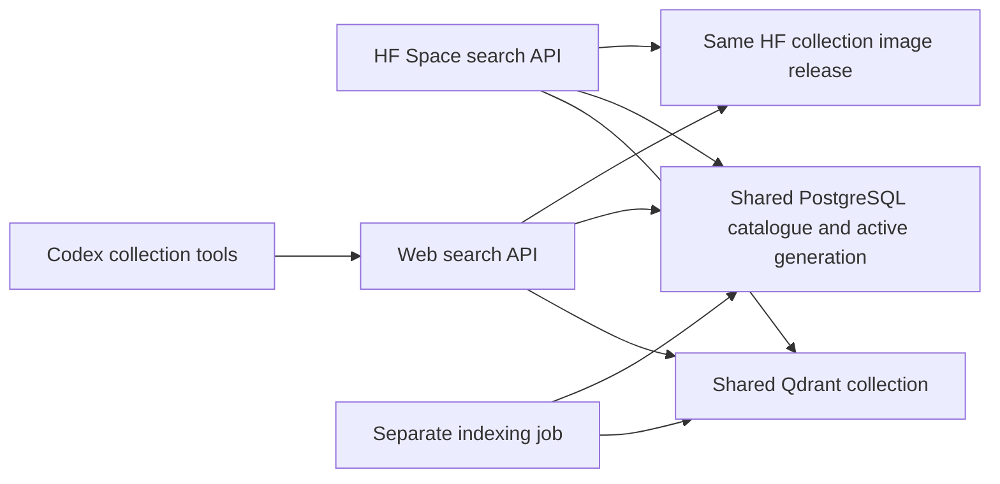
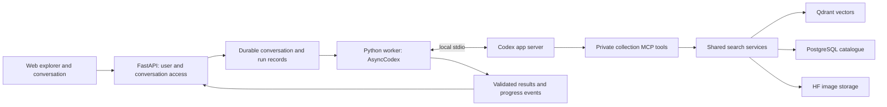

# Collection Explorer versions and Codex integration

Implemented locally on 4 October 2026. This document records the two build
targets, the Codex integration and the remaining hosted validation.

## Two deployments from one repository

| | Hugging Face explorer | Web application |
| --- | --- | --- |
| Purpose | Public dataset exploration | Conversation with an agent that explores the collection |
| Features | Browse, text search, image search, find similar, filters, details and attribution | The same explorer plus questions, query refinement, comparisons and evidence-backed answers |
| Execution | React and FastAPI in a Docker Space | React, FastAPI and a private Codex worker on a host that supports long-running processes |
| Retrieval | SigLIP 2 on CPU, Qdrant vectors, PostgreSQL catalogue | The same search services, exposed to Codex through collection tools |
| Images | HF storage mounted read-only | HF storage; stage bounded image inputs for the agent when needed |
| Model access | Local embeddings; no model API key or daily search quota | Server-owned Codex API key; model and spending budget must be configured |
| Access | Public app | Hugging Face OAuth accounts; private conversations |
| Image Studio | Excluded | Deferred until after the first web release; existing prototype retained separately |

Keep shared search services, schemas and result components in this repository.
Produce separate application entry points and deployment artifacts rather than
maintaining two copies of search. Both deployments read the same published
catalogue and Qdrant collection. Give each its own credentials and compute;
indexing and publication remain separate operations.

The web application should call its own search service. Routing paid agent turns
through the public demonstration Space would couple web availability to the
Space's sleep, restart and capacity behaviour.

The public HF target replaces the previous invitation-only deployment plan.
A public Space exposes both its application and repository. HF currently requires
a paid account plan to create Docker Spaces, even though CPU Basic has no hourly
compute charge. Confirm account eligibility before provisioning.
[HF Spaces overview](https://huggingface.co/docs/hub/spaces-overview).

## Shared retrieval contract

Index each dataset release once. The HF edition, ordinary web search and Codex
collection tools all retrieve from that published index through `SearchService`.
Codex can choose queries and filters; it does not select a different vector
database, embedding model or collection. Uploads used as search queries do not
become indexed collection images.



| Configuration | Contract across both editions |
| --- | --- |
| `QDRANT_URL` | Resolves to the same Qdrant server or cluster. Local and container addresses can differ. |
| `QDRANT_COLLECTION_NAME` | Same collection, matching the active PostgreSQL generation. An explicit mismatch disables vector search with `index_mismatch`. If omitted, the catalogue supplies the collection name. |
| `QDRANT_API_KEY` | Server-side credential for that shared collection; the deployments can use separate credentials. |
| `DATABASE_URL` | Same collection catalogue and active generation; web conversation tables remain private to the web API. |
| `CATALOGUE_TRANSPORT` | HF search uses `neon_http` on 443; local/web use `postgres`. Both execute one shared set of parameterized catalogue queries. |
| `EMBEDDING_MODEL`, `EMBEDDING_REVISION`, `EMBEDDING_DIMENSIONS` | Match each other and the published index. The shared implementation fixes preprocessing. Mismatches disable vector search. |
| `IMAGE_ROOT` | Mounts the same collection image release with the catalogue's relative paths and checksums. The mount path itself may differ between hosts. |

Apply catalogue migrations as an operator before deployment (`make migrate`);
search API startup performs reads only. The HF runtime can use a reader role.
Web conversation migrations and the supervisor lock still use native PostgreSQL.

Each API creates query embeddings on its own CPU; the stored collection vectors
are shared. Neither API nor Codex publishes vectors. Use the separate indexing
command for writes and coordinate both API deployments when publishing a new
dataset/model generation. When updating a permanent collection, stop both APIs
and restart them after publication.

The local Compose `web` profile inherits the search app's catalogue, Qdrant,
embedding configuration and read-only collection/model mounts. Only its app
image, public port, authentication and private conversation state differ. This
replaces manual configuration of a second container. A real Qdrant integration
test starts both APIs against one publication, compares search/tool results and
attribution, and checks that queries neither change vectors nor create collections.

The Python regression suite passes all 268 tests after adding HTTPS catalogue
access. Both Docker editions rebuilt, and a disposable container verified the
separate migration step and packaged HTTPS adapter. Native/HTTPS parity tests
execute the same queries against real PostgreSQL through a Neon protocol
stand-in. The refreshed local previews return identical results and attribution
from the same 100-image generation. Reports are saved under
`data/local-preview/validation-shared-index.json` and `validation-neon-http.json`
(ignored). Live Neon HTTPS and HF connections still require hosted checks.

## Harness selection

Use **Codex app server through the Python `openai-codex` SDK**, with `AsyncCodex`
in a dedicated worker. The current official SDK documentation describes the
Python release as stable and says it controls local app server over JSON-RPC,
with a pinned CLI runtime dependency. This fits the existing Python backend
without another application language or a hand-written transport client.
[Codex SDK](https://learn.chatgpt.com/docs/codex-sdk).

| Option | Assessment |
| --- | --- |
| OpenAI model API client | Provides model requests. Our code would still own the agent loop, tools and context; it does not supply the requested Codex harness. |
| Direct `codex exec --json` | Useful for batch experiments and evaluation scripts. Its process and event handling would add work to an interactive conversation service. |
| TypeScript Codex SDK | Suitable when the orchestration service is Node. It introduces another backend runtime here. |
| Raw app-server protocol | Provides thread, turn, interruption and streamed-event control. Implementing its protocol directly adds schema and transport maintenance. |
| Python Codex SDK over app server | Selected integration route. Keep the adapter small and verify the required event and lifecycle APIs against the pinned SDK. |

App server is documented as the integration surface for rich clients, while
`codex exec` targets non-interactive work. App-server documentation also warns
that the command and WebSocket transport are experimental and unsupported for
production workloads. The stable Python SDK does not remove that qualification.
Use local stdio, validate the pinned runtime, and resolve production support
before a public web launch. The selection is for the implementation pilot;
production readiness has not been established.
[App server](https://learn.chatgpt.com/docs/app-server),
[non-interactive mode](https://learn.chatgpt.com/docs/non-interactive-mode).

## Web request flow



Codex owns query planning, tool selection, follow-up reasoning and its context.
FastAPI owns identity, access checks, durable results and browser event delivery.
SigLIP still creates search vectors; Codex interprets the request and the results.
For example, a request for British cameras before 1950 can become a short semantic
query plus date/place filters, followed by inspection of matching records.

Expose a small, read-only collection MCP service:

| Tool | Behaviour |
| --- | --- |
| `search_text` | Short semantic query, validated filters and bounded result count |
| `search_image` | Search using an upload ID belonging to the requesting user |
| `find_similar` | Search from an indexed image UUID, excluding that image |
| `get_filter_options` | Return supported date, place and category filters |
| `get_image_details` | Return catalogue metadata, associations, attribution and a bounded image preview |
| `lookup_record` | Exact parameterized PostgreSQL lookup such as `co25823`; return all distinct associated images in the ready generation |

Tool results carry stable image IDs, source URLs, licences and index generation.
Validate result references before rendering cards or citations. A missing field
remains unknown; an embedding score is not evidence for an unsupported historical
claim. Exact record lookup distinguishes an unavailable catalogue from an indexed
catalogue with no matching images.

Codex supports stdio and HTTP MCP tools with tool allowlists. Use the collection
service as a required tool source and enforce permissions in that service.
This uses Codex as an MCP client; it does not require the removed
`codex mcp-server` command or experimental dynamic tools.
[Codex MCP](https://learn.chatgpt.com/docs/extend/mcp).

## Hosting, access and state

Run the Codex worker behind the application API. The browser receives only our
conversation API and events. Restrict filesystem and network access and verify
that shell, file mutation and unrelated tools are unavailable to collection
conversations. A read-only filesystem preset alone does not disable shell access
or isolate users. The existing Image Studio child-process executor is not an
isolation boundary suitable for running arbitrary Codex commands.

Use isolated worker state for separate users, scoped collection-tool credentials,
and a clean configuration. Database and storage secrets stay in the trusted
collection service. Do not inherit the developer's personal Codex login, plugins,
MCP configuration or filesystem. Validate these boundaries with hostile prompt
and cross-user access tests before exposing the service.

Use server-side API-key authentication for the pilot, subject to model access.
The app's user login is separate from Codex authentication. Official guidance
recommends API keys for programmatic use and warns against exposing Codex execution
in untrusted or public environments. Keep execution private and qualify the
controlled product integration before launch.
[Codex authentication](https://learn.chatgpt.com/docs/auth).

PostgreSQL should own user-to-conversation-to-Codex-thread mappings, submitted
messages, run state and validated results. Preserve Codex rollout state on private
durable storage so a thread ID remains resumable after worker replacement. An
opaque thread ID is not authorization. Serialize turns within a conversation,
make submissions idempotent and support cancellation and SSE reconnection.
After an uncertain worker failure, reconcile state before allowing another turn;
do not automatically replay the request. Measure Codex's own retries and usage
rather than assuming the old provider client's single-attempt semantics apply.

Logfire remains metadata-only. Set agent concurrency, duration and spending
controls independently of ordinary search, which retains no daily quota.
Select an image-capable model for visual reasoning and evaluate it with the
actual collection before choosing a production model.

## Implemented editions

| Edition | Backend | Frontend output | Python extra | Docker build argument |
| --- | --- | --- | --- | --- |
| HF search | `app.main:app` | `frontend/dist/search` | None | `EDITION=search` (default) |
| Web companion | `app.web:app` | `frontend/dist/web` | `web` | `EDITION=web` |
| Image Studio prototype | `app.studio:app`; optional worker through `app.space` | `frontend/dist/studio` | `agent` | `EDITION=studio` |

The Dockerfile fixes the entry point at build time. Its Python source allowlist
excludes the agent packages from search and excludes Image Studio from web.
Vite builds an edition-specific route tree. Search has no conversation route,
agent API or Studio chunks, even if `AGENT_ENABLED=true` is set by mistake.
The shared repository still retains Studio source for later image-generation work.

The `web` extra pins `openai-codex==0.160.0`, including its CLI runtime dependency.
`backend/app/explore` owns the SDK adapter, MCP tools, OAuth, conversations,
scoped uploads, events and separate Alembic migrations. It does not import the
Studio provider or require Gemini, brand profiles or generation workflows.

## Run the web edition

Install dependencies with `uv sync --locked --all-packages --extra web` and
configure the `EXPLORER_` settings in `.env.example`. Register a Hugging Face
OAuth application using the exact callback
`EXPLORER_PUBLIC_URL/api/v1/explorer/auth/callback`. The public URL is an origin,
without a path; HTTPS is required outside loopback. HF sign-in uses authorization
code flow with PKCE, a signed five-minute state cookie and an eight-hour signed
session cookie. Mutations require the configured Origin. OAuth tokens stay on
the server and are discarded after obtaining the account subject.
[Hugging Face OAuth](https://huggingface.co/docs/hub/oauth).

Set `EXPLORER_OAUTH_CLIENT_ID`, its client secret when issued,
`EXPLORER_SESSION_SECRET` (at least 32 random characters), `EXPLORER_API_KEY`,
and an image-capable `EXPLORER_MODEL` available to that key. Run:

```sh
make web
# Or use separate terminals for reload/Vite development:
make web-backend
make web-dev
# Build the deployment artifact:
docker build --platform linux/amd64 --build-arg EDITION=web -t multimodal-web:local .
```

`make web` serves port 8000. If overriding `PORT`, also set
`EXPLORER_PUBLIC_URL` to the origin used by the browser. Vite development uses
`http://127.0.0.1:5173` as the public origin and the API on port 8000.
The Docker image uses port 7860. `EXPLORER_GATEWAY_URL` must point to that API's
loopback address; the browser never talks to Codex directly.

Run **one Uvicorn process per web database schema**. The supervisor holds a
direct PostgreSQL advisory lock and refuses a second owner. Provide
`DATABASE_URL_UNPOOLED` when using a transaction pooler; the existing Neon URL
resolver can derive a direct Neon endpoint when it is absent. Web migrations
also use the direct connection. If the supervisor connection fails, active work
is cancelled and the service requires a restart.

Mount `EXPLORER_STATE_DIR` on a private durable volume. It stores staged user
uploads and per-conversation Codex state; PostgreSQL stores ownership and run
history. Collection images continue to come from the HF mount. Back up private
state and PostgreSQL together. User uploads are capped at 100 per account and
conversations at 100, with 30 turns each by default. These are storage bounds;
ordinary embedding searches retain no daily quota. Account deletion and an
operator retention policy must be established before a public web launch.

Each active turn starts a child process with a clean environment and private
Codex home. Database, HF storage, session and Logfire secrets are not inherited.
The child receives the model key over stdin and logs no raw SDK output. Its MCP
adapter receives only an expiring token for that run. Collection tools verify
ownership, arguments, tool count and catalogue generation. Final image IDs must
come from evidence collected in the current turn; result cards use the server's
metadata and attribution. Cross-generation evidence is rejected.

The pinned runtime is configured without shell execution, local image viewing,
browsing, plugins, code execution or image generation. The runtime test inspects
the actual model tool list. Only the six collection tools and harmless Codex
resource/question helpers are exposed. Read-only tool annotations permit MCP
calls under the deny-all approval policy. Clarifying questions belong in the
answer so the user can reply in a follow-up turn.

This configuration is not an OS boundary between hostile arbitrary processes.
Keep the web execution service private behind the API and validate container
filesystem and network restrictions on the chosen host before public release.

Defaults allow two active turns, eight queued/running turns total, 180 seconds
per turn and 20 collection tool calls. These bounds are configurable. They are
not a currency spending cap; configure provider/project spending controls and
measure live usage before opening access. Runtime token usage is saved with
results, while Logfire captures run metadata without prompts or provider errors.

The UI supports text or an image with a question, collection ID and image
selection, follow-up turns, account-owned history, streamed tool progress,
cancellation and recovery after a dropped event connection. Submissions use an
idempotency key; retrying a lost response reuses it. A failed or restarted worker
never automatically replays a model request. Startup marks uncertain work as
interrupted and retains the thread ID for a later deliberate turn.

## Validation and remaining work

Local tests cover user isolation, OAuth state/PKCE and expiry, upload ownership,
validation, evidence references, tool expiry/budgets, cancellation, idempotency,
event cursors and crash recovery. A local fake Responses endpoint exercises the
real pinned Codex binary and MCP adapter, including image input, thread resume and interruption, without paid
requests. Browser checks cover both edition routes and the web interaction flows.
The final local check passed 250 Python tests, 28 browser tests, Ruff, Biome,
all three frontend builds and both release Docker builds. Artifact inspection
confirmed that search excludes agent source and SDKs even with the legacy enable
flag set, and that web excludes Studio. The pinned Linux Codex binary runs in
the web image. Both containers start against the local fixture; search passes
all 100 image checksums, text retrieval, image self-matching and similar-image
exclusion. The report is `data/local-preview/validation-editions.json` (ignored).
These fixtures verify integration mechanics; they do not establish model quality.

| Remaining work | Completion check |
| --- | --- |
| Host the HF search release | Provision storage, catalogue and Qdrant; deploy and complete [hosted acceptance](huggingface_spaces.md). |
| Configure web credentials | Register the real HF OAuth app and select a Codex model/API project; test actual login and model calls. |
| Evaluate collection exploration | Check 100-image relevance, visual grounding, exact IDs, follow-ups, latency and cost, then repeat on a representative larger sample. |
| Qualify the web host | Confirm app-server production support, durable state, backups, process termination, network/filesystem isolation and recovery on that host. |
| Public web operations | Set provider spending controls and an account deletion/retention policy before general access. |

Image generation remains a later web milestone. `make studio` runs the retained
prototype separately; it is excluded from both release artifacts.
